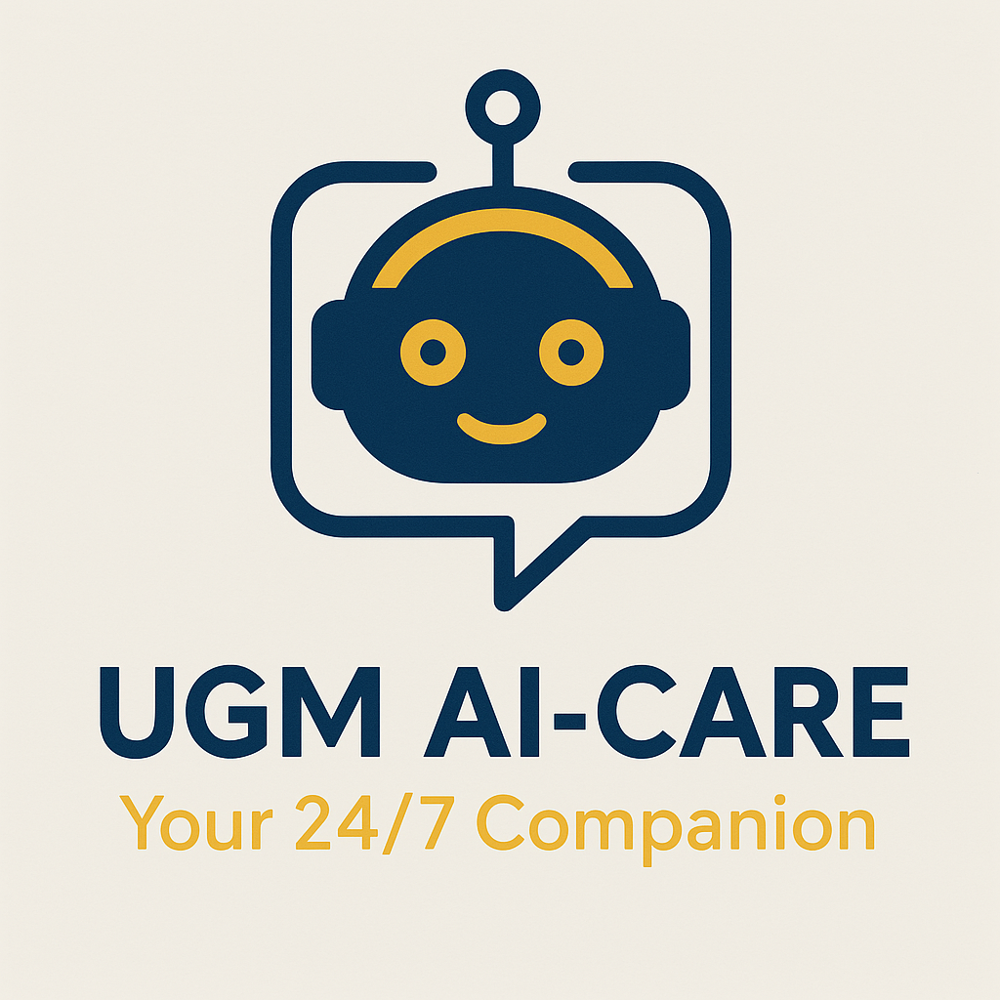

# UGM-AICare: Agentic Mental Health Support System 🌟



**Live Demo:** [https://aicare.sumbu.xyz](https://aicare.sumbu.xyz) | **API:** [https://api.aicare.sumbu.xyz](https://api.aicare.sumbu.xyz)

---

## 🔒 Security Notice

**Critical Security Update (Dec 8, 2025):** This project has been patched against **CVE-2025-66478** (CVSS 10.0) and **CVE-2025-55182** - critical Remote Code Execution vulnerabilities affecting React Server Components and Next.js App Router.

✅ **Current Versions (Patched):**

- Next.js: **16.0.7** (was 16.0.0)

## 🐳 Docker Compose (Profiles)

This repository uses Docker Compose **profiles** to reduce duplicated compose files. The canonical Compose files live in `infra/compose/`.

```bash
# Dev (app only)
docker compose -f infra/compose/docker-compose.dev.yml up -d

# Dev + monitoring (Prometheus/Grafana/exporters/Langfuse)
docker compose -f infra/compose/docker-compose.dev.yml --profile monitoring up -d

# Dev + monitoring + ELK (Elasticsearch/Logstash/Kibana/Filebeat)
docker compose -f infra/compose/docker-compose.dev.yml --profile monitoring --profile elk up -d

# Prod (app only)
docker compose -f infra/compose/docker-compose.prod.yml --env-file .env up -d

# Prod + monitoring/logging (enable profiles as needed)
docker compose -f infra/compose/docker-compose.prod.yml --env-file .env --profile monitoring --profile elk up -d
```

If you prefer scripts, `./dev.sh` wraps the most common local commands.

## Development and split-subdomain deployment

The repository is commonly deployed with distinct subdomains:

- Frontend: `https://aicare.sumbu.xyz`
- Backend: `https://api.aicare.sumbu.xyz`

For local development, a typical configuration is `NEXTAUTH_URL=http://localhost:22000` and `NEXT_PUBLIC_API_URL=http://localhost:22001`.

### 1.1 The Challenge

University mental health services globally face a "reactive capacity crisis." Traditional support systems are:

- **Reactive:** Waiting for students to reach crisis points before intervention.
- **Under-Resourced:** High counselor-to-student ratios (often 1:1000+).
- **Data-Constrained:** Lacking real-time insights into population-level mental health trends.

### 1.2 Mission & Solution Goal

**UGM-AICare** aims to transform university mental health support from a reactive service to a **proactive, agentic ecosystem**.

- **Proactive Intervention:** Early detection of distress signals using semantic analysis.
- **Agentic Automation:** Coordinated AI agents handling triage, coaching, and case management.
- **Privacy-First:** Institution-grade privacy with k-anonymity and differential privacy.

---

## 🧠 Chapter 2: Multi-Agent Architecture

### 2.1 Agentic Architecture Principles

Unlike traditional chatbots, UGM-AICare uses a **Multi-Agent System (MAS)** based on the **Belief-Desire-Intention (BDI)** model.

- **Belief (State):** What the agent knows (User Profile, Conversation History, Risk Level).
- **Desire (Goal):** What the agent wants to achieve (Ensure Safety, Reduce Anxiety).
- **Intention (Action):** What the agent decides to do (Execute Triage, Generate Plan).

### 2.2 Agent Orchestration with Aika

The system is orchestrated by **Aika**, a Meta-Agent that coordinates four specialized sub-agents using LangGraph. Each agent has a distinct responsibility, ensuring separation of concerns and efficient resource utilization.

```bash
                    ┌─────────────────────────────────────────────────────┐
                    │                  USER MESSAGE                       │
                    └─────────────────────────────────────────────────────┘
                                           │
                                           ▼
                    ┌─────────────────────────────────────────────────────┐
                    │              🤖 AIKA (Meta-Agent)                   │
                    │  ─────────────────────────────────────────────────  │
                    │  • Intent Recognition & Routing                     │
                    │  • Conversation State Management                    │
                    │  • Covert Mental Health Screening                   │
                    │  • Response Synthesis                               │
                    └─────────────────────────────────────────────────────┘
                         │           │            │            │
           ┌─────────────┘           │            │            └─────────────┐
           ▼                         ▼            ▼                          ▼
    ┌─────────────┐           ┌─────────────┐  ┌─────────────┐        ┌─────────────┐
    │  🛡️STA     │           │  🧠 TCA    │  │  📋 CMA     │        │  📊 IA      │
    │  Safety     │           │  Therapeutic│  │  Case       │        │  Insights   │
    │  Triage     │           │  Coach      │  │  Management │        │  Analytics  │
    └─────────────┘           └─────────────┘  └─────────────┘        └─────────────┘
```

### 2.3 Specialized Agent Roles & Responsibilities

| Agent | Full Name | Primary Responsibility | Key Functions |
|-------|-----------|------------------------|---------------|
| **🤖 Aika** | Meta-Agent Orchestrator | Central coordination and user interface | Intent classification, agent routing, response synthesis, screening profile updates |
| **🛡️ STA** | Safety Triage Agent | Risk assessment and crisis detection | Message-level risk scoring (0-3), conversation-level analysis, covert screening extraction, PII redaction |
| **🧠 TCA** | Therapeutic Coach Agent | Evidence-based therapeutic support | CBT-based interventions, coping strategies, psychoeducation, wellness activities |
| **📋 CMA** | Case Management Agent | Human escalation and resource coordination | Case creation, counselor assignment, appointment scheduling, follow-up tracking |
| **📊 IA** | Insights Agent | Privacy-preserving analytics | K-anonymous queries, trend analysis, population health dashboards |

### 2.4 Agent Workflow Details

#### 🛡️ STA (Safety Triage Agent)

The first line of defense, STA analyzes every incoming message for risk indicators:

1. **Tier 1 - Regex Rules (0-5ms):** Immediate keyword detection for crisis terms.
2. **Tier 2 - LLM Semantic Analysis (200ms):** Deep context understanding using Gemini 2.5.
3. **Screening Extraction:** Covertly extracts mental health indicators based on validated instruments.

**Risk Levels:**

- **Level 0:** No risk detected - normal conversation.
- **Level 1:** Mild distress - monitor and provide support.
- **Level 2:** Moderate risk - activate TCA for therapeutic intervention.
- **Level 3:** Crisis/Severe - immediate CMA escalation to human counselor.

#### 🧠 TCA (Therapeutic Coach Agent)

Provides evidence-based therapeutic support using CBT principles:

- **Cognitive Restructuring:** Helps identify and challenge negative thought patterns.
- **Behavioral Activation:** Suggests activities to improve mood.
- **Relaxation Techniques:** Guided breathing, grounding exercises.
- **Psychoeducation:** Explains mental health concepts in accessible terms.

#### 📋 CMA (Case Management Agent)

Handles high-risk situations requiring human intervention:

- **Case Creation:** Documents situation with risk assessment and context.
- **Smart Assignment:** Routes to available counselors based on specialty and workload.
- **Appointment Management:** Schedules sessions and sends reminders.
- **Follow-up Tracking:** Monitors case progress and outcomes.

#### 📊 IA (Insights Agent)

Provides anonymized analytics for institutional decision-making:

- **Population Health Trends:** Aggregated stress levels by faculty, semester.
- **Resource Optimization:** Identifies peak demand periods.
- **Privacy Guarantees:** All queries enforce k≥5 anonymity.

---

## 🔬 Chapter 3: Covert Screening & Validated Instruments

### 3.1 Covert Screening Approach

UGM-AICare implements a **covert mental health screening system** that passively extracts psychological indicators from natural conversation. Users are not aware they are being screened, which reduces social desirability bias and captures authentic mental states.

The STA agent performs dual analysis on every message:

1. **Risk Assessment:** Immediate safety evaluation.
2. **Screening Extraction:** Maps conversation content to validated instrument domains.

### 3.2 Validated Psychological Instruments

All screening dimensions are based on internationally validated instruments with established psychometric properties:

| Dimension | Instrument | Reference | Domains Assessed |
|-----------|------------|-----------|------------------|
| **Depression** | PHQ-9 (Patient Health Questionnaire-9) | Kroenke et al. (2001) | Anhedonia, depressed mood, sleep, fatigue, appetite, worthlessness, concentration, psychomotor changes, suicidal ideation |
| **Anxiety** | GAD-7 (Generalized Anxiety Disorder-7) | Spitzer et al. (2006) | Nervousness, uncontrollable worry, excessive worry, trouble relaxing, restlessness, irritability, fear of awful events |
| **Stress** | DASS-21 Stress Subscale | Lovibond & Lovibond (1995) | Difficulty relaxing, nervous energy, agitation, irritability, impatience, overwhelm, intolerance |
| **Sleep Quality** | PSQI (Pittsburgh Sleep Quality Index) | Buysse et al. (1989) | Sleep quality, latency, duration, efficiency, disturbances, medication use, daytime dysfunction |
| **Social Isolation** | UCLA Loneliness Scale (Version 3) | Russell (1996) | Social loneliness, emotional loneliness, perceived isolation, social withdrawal, companionship |
| **Self-Esteem** | RSES (Rosenberg Self-Esteem Scale) | Rosenberg (1965) | Self-worth, self-acceptance, self-competence, comparative worth, self-respect |
| **Substance Use** | AUDIT (Alcohol Use Disorders Identification Test) | Saunders et al. (1993) | Hazardous use, dependence symptoms, harmful use, coping drinking |
| **Crisis/Suicidality** | C-SSRS (Columbia Suicide Severity Rating Scale) | Posner et al. (2011) | Wish to be dead, suicidal thoughts, intent, plan, self-harm, preparatory behavior |
| **Academic Stress** | SSI (Student Stress Inventory) | Lakaev (2009), adapted | Academic pressure, fear of failure, thesis stress, peer comparison, future anxiety |

### 3.3 Scoring & Severity Thresholds

Each dimension uses instrument-specific thresholds normalized to a 0-1 scale:

```bash
Severity:    None     Mild     Moderate    Severe    Critical
             │        │        │           │         │
PHQ-9:       0───────0.19────0.37────────0.56──────0.74───────1.0
GAD-7:       0───────0.24────0.48────────0.71──────0.90───────1.0
DASS-21:     0───────0.19────0.29────────0.38──────0.60───────1.0
```

**Severity Labels:**

- **None:** Score below clinical threshold.
- **Mild:** Subclinical symptoms present.
- **Moderate:** Clinical attention recommended.
- **Severe:** Professional intervention needed.
- **Critical:** Immediate crisis response required.

### 3.4 Longitudinal Tracking

Screening profiles are updated with each conversation using exponential decay:

```bash
new_score = old_score × decay_factor + extracted_weight × update_factor
```

Where `decay_factor = 0.95` ensures recent indicators are weighted more heavily while maintaining longitudinal history.

---

## 🔒 Chapter 4: Research Questions & Governance

### 4.1 Research Questions (RQ)

This project is guided by three core research questions:

- **RQ1 (Proactive Safety):** Can an agentic system detect crisis signals with high sensitivity (>90%) and low false negatives?
- **RQ2 (Functional Correctness):** Can a LangGraph-based orchestrator reliably route intents without hallucinations?
- **RQ3 (Output Quality & Privacy):** Can the system generate clinically valid CBT responses while maintaining k-anonymity?

### 4.2 Clinical Governance

- **Human-in-the-Loop:** Critical risks (Level 3) are strictly escalated to human counselors via CMA.
- **Evidence-Based:** Interventions are grounded in CBT (Cognitive Behavioral Therapy) principles.
- **Consent Ledger:** Immutable audit trail of user consents and withdrawals.

### 4.3 Privacy & Compliance

- **k-Anonymity (k≥5):** Analytics queries never return data sets smaller than 5 individuals.
- **Differential Privacy:** Noise injection (ε-δ budgets) to prevent re-identification.
- **PII Redaction:** All text is scrubbed of names/phones/emails before storage or analysis.

---

## 🛠️ Chapter 5: Implementation Details

### 5.1 Technical Stack

- **Orchestration:** LangGraph (StateGraph, Conditional Edges).
- **Intelligence:** Google Gemini 2.5 (Chain-of-Thought Reasoning).
- **Backend:** FastAPI (Python), SQLAlchemy 2 (Async), Redis.
- **Frontend:** Next.js 15, Tailwind CSS 4, Framer Motion.
- **Blockchain:** EDU Chain (ERC1155) for Achievement Badges.

### 5.2 Project Structure

```bash
├── backend/
│   ├── app/
│   │   ├── agents/                    # LangGraph Agent Implementations
│   │   │   ├── aika/                  # Meta-Agent Orchestrator
│   │   │   │   ├── aika_graph.py      # Main orchestration logic
│   │   │   │   └── screening_awareness.py  # Screening gap analysis
│   │   │   ├── sta/                   # Safety Triage Agent
│   │   │   │   ├── sta_graph.py       # Risk assessment workflow
│   │   │   │   └── conversation_analyzer.py  # Deep analysis + screening
│   │   │   ├── tca/                   # Therapeutic Coach Agent
│   │   │   ├── cma/                   # Case Management Agent
│   │   │   └── ia/                    # Insights Agent
│   │   ├── domains/
│   │   │   └── mental_health/
│   │   │       └── screening/         # Validated instrument definitions
│   │   │           ├── instruments.py # PHQ-9, GAD-7, DASS-21, etc.
│   │   │           └── engine.py      # Profile update logic
│   │   └── routes/                    # API Endpoints
│   └── requirements.txt
├── frontend/
│   ├── src/
│   │   ├── app/
│   │   │   └── admin/                 # Admin Dashboard
│   │   │       └── screening/         # Screening monitoring interface
│   │   └── components/                # UI Components
│   └── package.json
└── docs/                              # Architecture Documentation
```

---

## 🚀 Getting Started

### Prerequisites

- Node.js 18+
- Python 3.9+
- PostgreSQL & Redis

### Local Development

```bash
# 1. Clone Repository
git clone https://github.com/gigahidjrikaaa/UGM-AICare.git

# 2. Start Backend
cd backend
python -m venv venv && source venv/bin/activate
pip install -r requirements.txt
uvicorn app.main:app --reload

# 3. Start Frontend
cd frontend
npm install && npm run dev
```

---

## 🤝 Contributing & License

**Maintainer:** [Giga Hidjrika Aura Adkhy](https://linkedin.com/in/gigahidjrikaaa)  
**License:** MIT License. See [LICENSE](LICENSE) for details.

*Built with ❤️ for UGM Students.*
