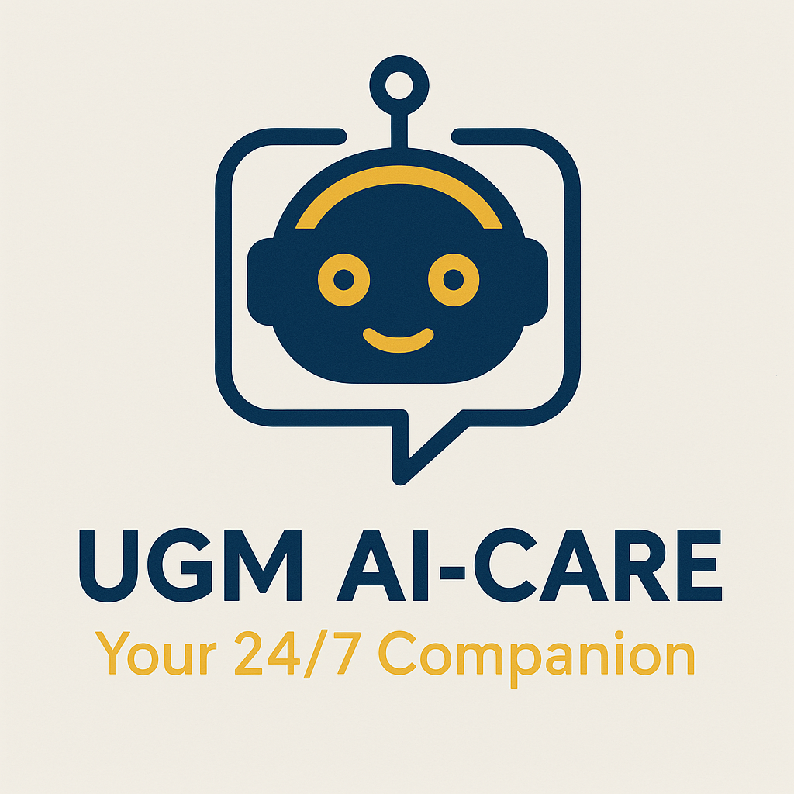

# UGM-AICare

**Agentic Mental Health Support System** — a multi-agent AI system for proactive, privacy-preserving mental health support in university settings.



**Live Demo:** [aicare.sumbu.xyz](https://aicare.sumbu.xyz) | **API:** [api.aicare.sumbu.xyz](https://api.aicare.sumbu.xyz)

**Full documentation:** [gigahidjrikaaa.github.io/UGM-AICare](https://gigahidjrikaaa.github.io/UGM-AICare/)

---

## Quick Start

```bash
git clone https://github.com/gigahidjrikaaa/UGM-AICare.git
cd UGM-AICare

# Docker (recommended) — per-service compose files
docker compose -f backend/docker-compose.yml -f frontend/docker-compose.yml up -d

# Or run manually:
# Backend:  cd backend && uvicorn app.main:app --port 22001
# Frontend: cd frontend && npm run dev -- -p 22000
```

## Tech Stack

| Layer | Technology |
|-------|-----------|
| Orchestration | LangGraph (StateGraph, Conditional Edges) |
| Intelligence | Google Gemini 2.5 (Chain-of-Thought) |
| Backend | FastAPI, SQLAlchemy 2 (async), Redis, PostgreSQL |
| Frontend | Next.js 15, Tailwind CSS 4, Framer Motion |
| Blockchain | EDU Chain (ERC-1155 Achievement Badges) |

## Architecture at a Glance

Five coordinated AI agents powered by the **Aika** meta-agent orchestrator:

| Agent | Role |
|-------|------|
| **Aika** | Meta-agent orchestrator — intent recognition, routing, screening |
| **STA** | Safety Triage — risk scoring (0-3), crisis detection, PII redaction |
| **TCA** | Therapeutic Coach — CBT-based interventions, coping strategies |
| **CMA** | Case Management — human escalation, counselor assignment |
| **IA** | Insights — k-anonymous analytics, population health trends |

## Research Questions

- **RQ1:** Can an agentic system detect crisis signals with &gt;90% sensitivity?
- **RQ2:** Can LangGraph reliably route intents without hallucinations?
- **RQ3:** Can the system produce clinically valid CBT responses under k-anonymity?

## Documentation

All project documentation lives in the [Docusaurus docs site](https://gigahidjrikaaa.github.io/UGM-AICare/):

- [System Overview](https://gigahidjrikaaa.github.io/UGM-AICare/docs/architecture/system-overview)
- [Agentic Framework](https://gigahidjrikaaa.github.io/UGM-AICare/docs/architecture/agentic-framework)
- [Covert Screening](https://gigahidjrikaaa.github.io/UGM-AICare/docs/passive-screening/covert-screening)
- [Tech Stack](https://gigahidjrikaaa.github.io/UGM-AICare/docs/engineering/tech-stack)
- [API Reference](https://gigahidjrikaaa.github.io/UGM-AICare/docs/engineering/api-reference)
- [Deployment Guide](https://gigahidjrikaaa.github.io/UGM-AICare/docs/deployment/setup)

## Security

Patched against **CVE-2025-66478** (CVSS 10.0). Current: Next.js 16.0.7.

## License

MIT — [Giga Hidjrika Aura Adkhy](https://linkedin.com/in/gigahidjrikaaa)
