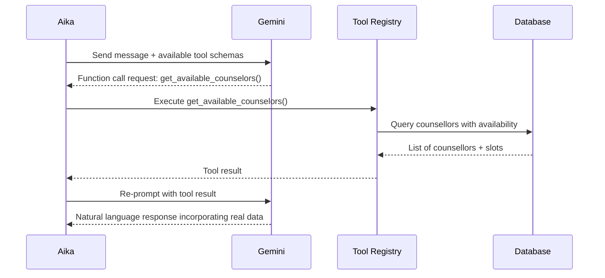

# Aika — The Orchestrator

## Who Is Aika?

**Aika** (愛佳) is the central persona of UGM-AICare. The name carries deliberate meaning:

- **愛 (Ai)** — Love, compassion
- **佳 (Ka)** — Excellence, beauty

Aika is the only agent students interact with directly. From a student's perspective, they are simply chatting with a supportive friend. Under the hood, Aika is a **meta-agent orchestrator**: it reads the student's message, decides which specialist agents need to be involved, coordinates them in parallel or sequence, and synthesises their outputs into a single coherent response.

---

## The Three Versions of Aika

Aika presents differently depending on who is talking to it. This is not cosmetic — the underlying tool access, system prompt, and permitted operations genuinely differ.

### For Students
Aika is an empathetic companion. It uses casual Indonesian (matching the student's register), avoids clinical jargon, and gently steers towards healthy coping behaviours. When the student needs a psychologist, Aika handles the entire booking flow conversationally.

### For Counsellors
Aika is a clinical assistant. It can retrieve case summaries, pull risk assessment histories, and trigger on-demand conversation analysis (i.e., manually invoke the STA on a specific conversation). It speaks more formally and surfaces data in structured formats.

### For Administrators
Aika is a data and operations interface. Administrators can query conversation statistics, search across all conversations, view active safety cases, and pull system health data.

---

## How Aika Makes Decisions

Every message passes through three fast checks before any LLM call is made:

### Step 1 — Crisis Keyword Scan (< 1 ms)

Aika maintains a hardcoded list of crisis terms in English and Indonesian:

```
"suicide", "bunuh diri", "kill myself", "end my life",
"tidak ingin hidup lagi", "self-harm", "menyakiti diri",
"overdose", "mau mati", "ingin mati"
```

If any of these appear, the risk level is immediately set to `HIGH` before the LLM is even called. This guarantees that the system never underestimates a crisis due to an LLM miscalibration.

### Step 2 — Small Talk Detection

Common greetings, acknowledgements, and filler phrases (`"halo"`, `"ok"`, `"makasih"`, `"hahaha"`) are matched against a lookup table. Small talk skips sub-agent invocation entirely and gets a direct, warm response in a single LLM call. This saves approximately 400 ms and meaningfully reduces API costs at scale.

### Step 3 — LLM Intent Classification

For everything else, Aika calls Gemini to classify the message intent:

| Intent | What Triggers It | Routing Decision |
| --- | --- | --- |
| `casual_chat` | Venting, general sharing | Direct empathetic response |
| `crisis` | Distress, suicidal ideation | TCA + CMA parallel fan-out |
| `appointment_scheduling` | Asking about counsellors, booking | CMA tool calls |
| `academic_stress` | Exam anxiety, burnout | TCA intervention plan |
| `information_inquiry` | Asking about services | Tool call + response |
| `analytics` | Admin/counsellor data queries | IA node |

---

## Tool Calling

Aika uses Gemini's **function calling** capability to interact with real data. Rather than generating appointment times from imagination, it calls `suggest_appointment_times()` and returns actual available slots from the database.

The tool-calling loop looks like this:



The iteration budget is capped per intent type to prevent runaway tool-calling loops:

| Intent | Max Iterations | Reasoning |
| --- | --- | --- |
| `casual_chat` | 1 | No tools needed |
| `information_inquiry` | 2 | One look-up, then respond |
| `appointment_scheduling` | 4 | Get counsellors → slots → book → confirm |
| Everything else | 3 | One emotional support tool call then respond |

---

## Memory and Context

Aika maintains two kinds of memory:

1. **Short-term (Redis):** The last 10 turns of the current conversation (20 messages). This is the "context window" sent to Gemini on each call. Keeping it at 10 turns caps input token cost while preserving conversational coherence.

2. **Long-term (PostgreSQL):** The student's profile, journal entries, past interventions, and screening history. These are not loaded by default — Aika calls `get_user_profile()` or `get_journal_entries()` when relevant context needs to be fetched.

---

## Screening — The Covert Layer

Aika embeds **covert mental health screening** into ordinary conversation. Without interrupting the flow of the chat, it maps what the student says against validated clinical instruments (PHQ-9 for depression, GAD-7 for anxiety, DASS-21 for stress/depression/anxiety). These extracted indicators are passed to the STA's post-conversation analysis.

Crucially, students are never asked "please complete this PHQ-9 questionnaire." The screening is woven into conversational responses — a design choice to reduce dropout and stigma friction.
