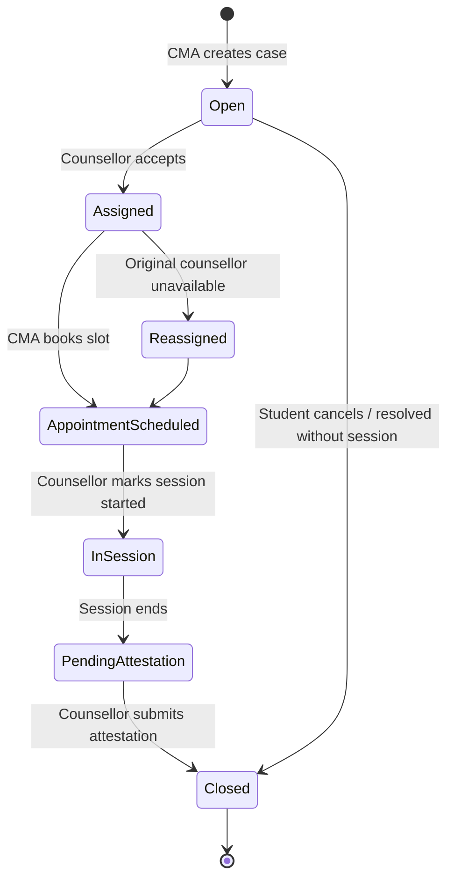
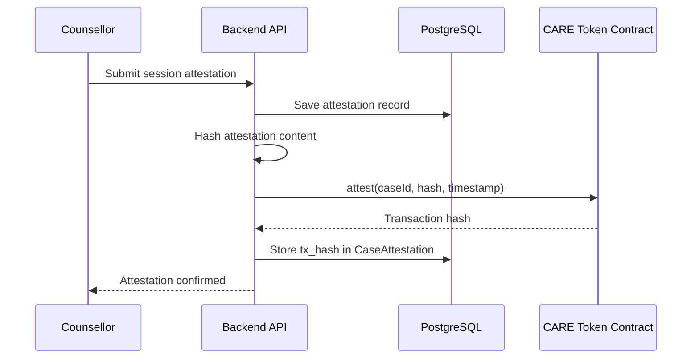

# CMA — Case Management Agent

## What Is the CMA?

The **Case Management Agent (CMA)** is the system's bridge between AI and human care. When the STA determines that a student's risk level warrants professional clinical support, the CMA takes over the operational work: opening a formal case, finding the right counsellor, scheduling an appointment, and tracking follow-up.

In clinical terms, the CMA handles **care coordination** — the logistical layer that, in a traditional service, would involve receptionists, administrative staff, and phone tag.

---

## When Is the CMA Invoked?

The CMA is triggered when:

1. **Risk level ≥ 2 (HIGH/CRITICAL)**: Automatically invoked in parallel with the TCA.
2. **Student explicitly requests counselling**: Detected by Aika's intent classifier (`appointment_scheduling` intent).
3. **STA post-conversation analysis recommends referral**: The STA's background analysis can write a `counsellor_recommendation` field, which a counsellor sees in their dashboard and can act on.

---

## The Case Lifecycle



Each state transition is persisted to the database and visible to both the student (simplified view) and the counsellor (full case details).

---

## Counsellor Assignment

The CMA selects a counsellor using a priority scoring algorithm:

1. **Specialisation match**: If the STA's `intent` suggests a particular area (e.g., `academic_stress`), counsellors with matching specialisations are ranked higher.
2. **Current caseload**: Counsellors with fewer active cases are preferred, distributing load fairly.
3. **Availability**: Only counsellors with open appointment slots in the next 72 hours are considered.
4. **Language preference**: Students can specify a preference for Bahasa Indonesia or English, filtered before ranking.

The student is shown the top two to three counsellor options and asked to confirm, rather than having a counsellor assigned without consent.

---

## Appointment Booking Flow

The CMA orchestrates a multi-step booking flow through Aika's tool-calling interface:

```
1. get_available_counselors()   →  Returns ranked list of counsellors
2. suggest_appointment_times()  →  Returns available slots for chosen counsellor
3. book_appointment()           →  Creates appointment record in DB
4. (Optional) Sends confirmation notification via SSE to frontend
```

The entire flow happens conversationally. The student does not navigate to a separate booking page. Aika says something like:

> *"I found two counsellors available this week — Bu Ratna specialises in academic stress, and Pak Andri has experience with anxiety. Which feels right? And would 10am tomorrow or 2pm Thursday work for you?"*

---

## Service Level Agreement (SLA)

The CMA enforces a soft SLA on case response times:

| Risk Level | Target Time to First Counsellor Contact |
| --- | --- |
| CRITICAL | Within 4 hours |
| HIGH | Within 24 hours |
| MODERATE | Within 72 hours |
| LOW (student-initiated) | Within 5 business days |

If a case is not picked up within its SLA window, the system generates an alert visible to the administrator dashboard.

---

## Blockchain Attestation

When a counsellor closes a case, they submit a **session attestation** — a signed summary of the intervention delivered. This attestation is:

1. Hashed (SHA-256)
2. Submitted as a transaction to the CARE token smart contract on Ethereum
3. The transaction hash is stored in the `CaseAttestation` table alongside the case record

This creates an immutable audit trail. Institutions can verify that a session occurred without accessing any clinical details — they only see the hash and the timestamp. The actual session notes remain in the encrypted PostgreSQL database.



---

## What the CMA Does Not Do

The CMA does not:

- Conduct therapy or psychological assessment
- Override a student's appointment preferences without confirmation
- Store clinical notes — those are written exclusively by the human counsellor
- Access any blockchain identity that could link to the student's personal data
