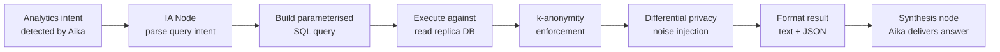

# IA — Insights Agent

## What Is the IA?

The **Insights Agent (IA)** is the system's analytics layer. While the other agents focus on individual student interactions, the IA operates at a **population level** — answering questions like "what proportion of students this semester are showing stress indicators?" or "which departments have seen a spike in anxiety-related conversations?"

The IA exists because the value of a mental health support platform is not limited to the students it helps directly. Aggregated, anonymised trend data helps counselling services allocate resources, identify at-risk cohorts early, and evaluate the effectiveness of their interventions.

---

## The Privacy Challenge

Population-level mental health analytics create a genuine privacy tension. The data is sensitive. Even "anonymised" aggregate statistics can leak individual information if the group sizes are small.

The IA addresses this with two complementary privacy mechanisms:

### k-Anonymity

Every analytics query enforces a minimum group size. If a query would return a result representing fewer than **k individuals** (default k = 5), the result is suppressed or generalised. For example:

- *"How many Computer Science students reported depression indicators this week?"* → If the answer is 3, the IA returns `< 5` rather than the precise count.
- This prevents an administrator from reverse-engineering individual students from small-group queries.

### Differential Privacy

For aggregate statistics (means, percentages, score distributions), the IA adds calibrated statistical noise before returning results. The noise magnitude is tuned via a privacy budget parameter (epsilon, ε). Smaller ε = more noise = stronger privacy guarantee, at the cost of slightly less precise statistics.

These two mechanisms together mean the IA can honestly say: **no individual student's mental health status can be inferred from its outputs**, even by an adversary with knowledge of the general population.

---

## What the IA Can Answer

The IA is invoked when an administrator or counsellor asks a question through Aika that requires population-level data. Representative queries:

| Query Type | Example | Data Source |
| --- | --- | --- |
| **Trend analysis** | "How has the average risk score changed over the past 4 weeks?" | `ConversationRiskAssessment` aggregates |
| **Cohort comparison** | "Which faculties show the highest proportion of high-risk conversations?" | Cross-join with user faculty field |
| **Screening distributions** | "What is the distribution of PHQ-9 indicators across active students?" | `ScreeningProfile` table, k-anonymised |
| **Intervention effectiveness** | "Do students who completed a TCA plan show lower risk scores in subsequent conversations?" | Longitudinal join across `UserInterventionPlan` and `ConversationRiskAssessment` |
| **Counsellor workload** | "How many open cases does each counsellor currently have?" | `CaseManagement` table (not anonymised — counsellor data is not sensitive in this context) |

---

## How the IA Works Inside LangGraph

The IA node is reached when Aika's intent classifier routes a message to `analytics`. The node:

1. Parses the natural language query to identify the required metric, time range, and cohort filter
2. Translates this to a parameterised SQL query (never raw user input — all parameters are sanitised)
3. Applies k-anonymity enforcement and differential privacy noise
4. Formats the result as a natural language summary plus a structured JSON object (which the frontend renders as a chart)

---

## Dashboard Integration

The IA feeds data to the **counsellor and administrator dashboard**, which visualises:

- **Population risk heatmap** — risk level distribution by faculty and week
- **Screening trend lines** — PHQ-9, GAD-7, DASS-21 community scores over time
- **Intervention funnel** — how many conversations → STA flags → TCA plans → CMA cases → resolved cases
- **Counsellor performance metrics** — average time to case acceptance, SLA compliance rates

All charts are rendered client-side in the Next.js dashboard. The IA provides the data; the frontend handles visualisation.

---

## Access Control

IA queries are only available to users with `counsellor` or `admin` roles. This is enforced at two layers:

1. **Aika's tool allowlist**: The `counsellor` and `admin` role allowlists include analytics-capable tools; the `user` role does not.
2. **API endpoint RBAC**: The backend endpoints that serve IA data explicitly check the caller's role before processing.

A student cannot ask Aika for population-level data and receive a meaningful response — even indirectly.
