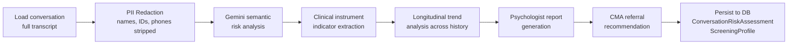

# STA — Safety Triage Agent

## What Is the STA?

The **Safety Triage Agent (STA)** is the system's clinical risk layer. Its job is to assess the mental health risk present in a student's conversation — both at the level of individual messages (real-time) and at the level of a complete conversation (post-hoc).

One design decision defines the STA more than any other: it runs **after** the conversation ends, not inside it. This means the STA never adds latency to a student's experience, and it can take as much time as it needs to do a thorough clinical analysis.

---

## Two Modes of Operation

### Mode 1 — Real-Time Signal Detection (embedded in Aika)

Before the STA even runs as a standalone agent, Aika itself performs the fastest possible risk checks:

1. **Keyword scan** (< 1 ms): Regex match against a list of crisis terms in English and Indonesian. A hit immediately escalates risk to `HIGH`.
2. **LLM semantic check** (~150 ms): If no keyword matches but the message seems emotionally heavy, Gemini performs a deeper understanding of risk context.

The result is a `risk_level` integer from 0 to 3 that is written to the shared `SafetyAgentState` and used to route the message through the orchestrator graph.

### Mode 2 — Post-Conversation Deep Analysis (background task)

After a conversation ends (or at a counsellor's manual request), the full STA graph runs as an async background task. This is a multi-step pipeline:



---

## Risk Scoring

The STA produces three risk artefacts per conversation:

| Artefact | Type | Description |
| --- | --- | --- |
| `risk_level` | Integer 0–3 | Categorical severity score |
| `risk_score` | Float 0.0–1.0 | Continuous probability estimate |
| `severity` | String | Human-readable label |

| Level | Score Range | Label | System Response |
| --- | --- | --- | --- |
| 0 | 0.0–0.29 | `low` | No sub-agent invocation |
| 1 | 0.30–0.59 | `moderate` | TCA invoked for coaching |
| 2 | 0.60–0.79 | `high` | TCA + CMA parallel fan-out |
| 3 | 0.80–1.0 | `critical` | TCA + CMA + immediate escalation |

---

## Covert Clinical Screening

The STA extracts indicators aligned to three validated clinical instruments from the natural conversation text. Students never fill out a questionnaire; the STA infers their likely responses from what they say.

| Instrument | Measures | Items Tracked |
| --- | --- | --- |
| **PHQ-9** | Depression severity | Interest loss, hopelessness, sleep, concentration, energy |
| **GAD-7** | Anxiety severity | Worry frequency, restlessness, irritability, control difficulty |
| **DASS-21** | Depression, Anxiety, and Stress | Combined 21-item indicator set |

These extracted indicators are accumulated in the student's `ScreeningProfile` table over time, building a longitudinal view of their mental health trajectory. Counsellors see this as a trend chart in their dashboard.

:::info Note on validity
Covert screening from conversational text is **indicative, not diagnostic**. The STA's screening outputs are intended to assist counsellors in prioritisation, not to replace formal clinical assessment.
:::

---

## Privacy: PII Redaction

Before any conversation text is passed to an LLM for analysis, the STA applies a PII redaction step. The following categories are detected and replaced with placeholders:

- Full names → `[NAME]`
- Student ID numbers (NIM) → `[ID]`
- Phone numbers → `[PHONE]`
- Email addresses → `[EMAIL]`
- Specific dormitory or address details → `[LOCATION]`

This ensures that even if conversation logs are used for model fine-tuning or analytics in the future, raw PII cannot be extracted from them.

---

## Manual Trigger

Counsellors and administrators can manually trigger the STA analysis on any conversation via Aika's `trigger_conversation_analysis` tool, or directly through the API at:

```
POST /api/v1/sta/analyze/{conversation_id}
```

This is useful when a counsellor is reviewing a historical conversation and wants a fresh clinical summary without waiting for the automated background task.

---

## Output: The Clinical Report

The STA produces a structured `ConversationRiskAssessment` record:

```json
{
  "conversation_id": 4812,
  "user_hash": "u_a3f8c1b2",
  "risk_level": 2,
  "risk_score": 0.71,
  "severity": "high",
  "intent": "academic_stress_with_hopelessness",
  "phq9_indicators": ["anhedonia", "low_energy", "concentration_difficulty"],
  "gad7_indicators": ["excessive_worry", "restlessness"],
  "trend": "worsening",
  "counsellor_recommendation": "Priority referral to clinical psychologist within 48h",
  "summary": "Student expressed persistent hopelessness about academic performance...",
  "analysed_at": "2026-02-27T14:23:11Z"
}
```

This record is visible to the assigned counsellor in their dashboard. The `user_hash` is a one-way hash of the student's ID — counsellors with the right access level can dereference the hash, but it appears anonymised in all IA analytics queries.
