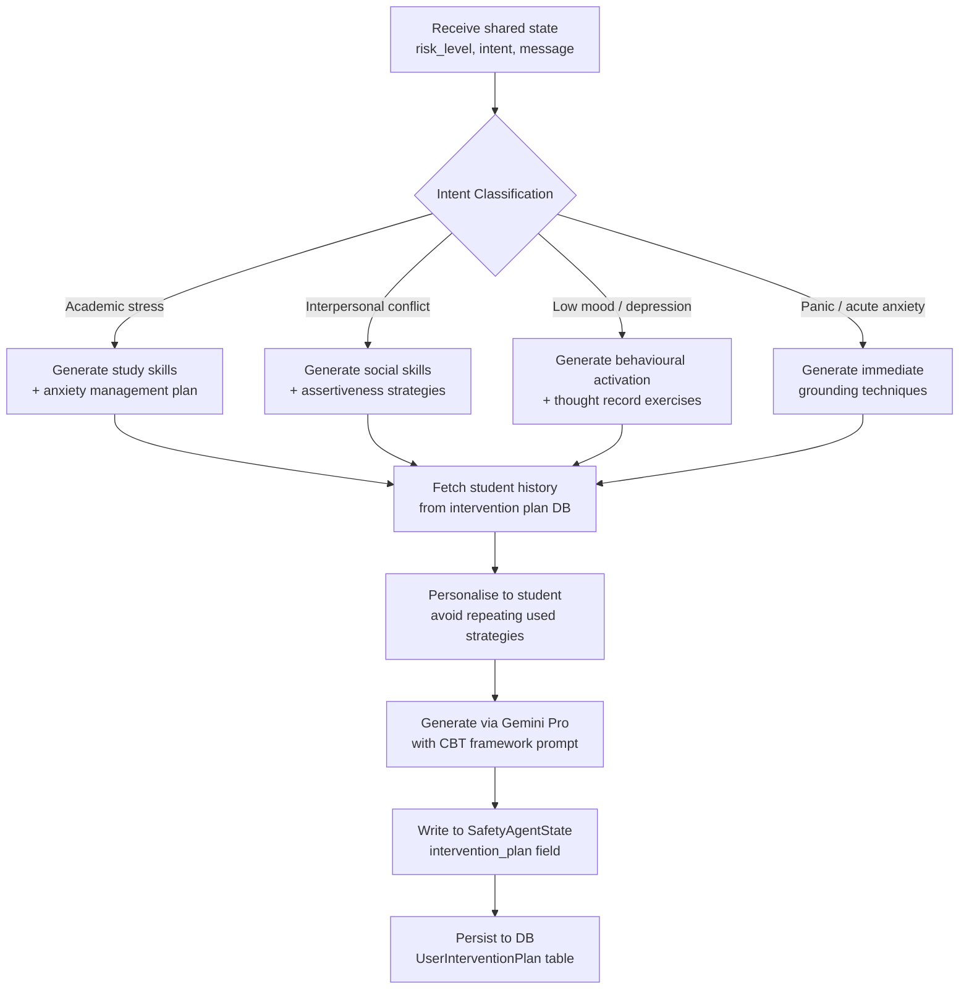

# TCA — Therapeutic Coach Agent

## What Is the TCA?

The **Therapeutic Coach Agent (TCA)** is the system's evidence-based support layer. When the STA determines that a student needs more than empathetic conversation, the TCA is invoked to provide structured, clinically-guided interventions.

The TCA is grounded in **Cognitive Behavioural Therapy (CBT)** — one of the most empirically validated approaches in psychology. CBT works on the premise that thoughts, feelings, and behaviours are interconnected, and that changing unhelpful thought patterns can reduce emotional distress.

---

## When Is the TCA Invoked?

The TCA is called by the orchestrator under two conditions:

1. **Moderate risk** (`risk_level = 1`): The STA has detected distress signals that warrant structured support but not immediate clinical escalation.
2. **High/Critical risk** (`risk_level ≥ 2`): The TCA runs in **parallel** with the CMA. Both agents start simultaneously, and their outputs are merged in the synthesis node.

The TCA is *never* invoked for casual conversation or simple information queries — this preserves its clinical weight and avoids "therapy-washing" ordinary chat.

---

## What the TCA Produces

The TCA's primary output is an **intervention plan** — a structured object that Aika incorporates into its response and persists to the database.

```json
{
  "plan_id": "tcp_8f3a2c",
  "user_id": 1203,
  "category": "academic_stress",
  "coping_strategies": [
    "5-4-3-2-1 grounding technique for acute anxiety",
    "Pomodoro time-blocking for exam preparation",
    "Scheduled worry time (15 min/day, then redirect)"
  ],
  "psychoeducation": "Exam anxiety is a normal physiological response...",
  "homework": "Write down three thoughts about exams and identify the cognitive distortion in each.",
  "follow_up_trigger": "3 days",
  "evidence_base": "CBT for academic anxiety [Beck, 1979; Meichenbaum, 1985]"
}
```

---

## The Intervention Plan Generation Pipeline



The personalisation step (G → H) is important: the TCA checks what coping strategies have been suggested to this student before and avoids repeating ones they have already tried. This prevents the agent from feeling repetitive over long engagement periods.

---

## Wellness Activities Catalogue

Beyond the generated plan, the TCA has access to a curated catalogue of structured wellness activities. These are categorised by type and evidence base, and can be recommended directly in conversation:

| Category | Example Activities |
| --- | --- |
| **Breathing exercises** | Box breathing, 4-7-8 technique, diaphragmatic breathing |
| **Grounding techniques** | 5-4-3-2-1 sensory, cold water immersion, body scan |
| **CBT exercises** | Thought records, cognitive restructuring worksheets, behavioural experiments |
| **Psychoeducation** | Short explainers on anxiety, depression, stress physiology |
| **Lifestyle anchors** | Sleep hygiene, exercise scheduling, social connection |

---

## Journaling Integration

The TCA encourages students to maintain a digital journal within the platform. Journal entries serve as:

1. **Therapeutic homework** — completing assigned reflective exercises
2. **Longitudinal mood tracking** — the STA's background analysis can incorporate journal content for richer screening
3. **Conversation starters** — Aika can reference recent journal entries to make follow-up conversations feel continuous

---

## What the TCA Does Not Do

The TCA is deliberately scoped. It does **not**:

- Diagnose mental health conditions
- Prescribe or recommend medications
- Provide crisis counselling (that is the CMA's escalation path)
- Replace a human therapist

Every TCA-generated plan includes a disclaimer that it is supportive guidance, not clinical treatment, and that a trained counsellor is available if the student wants human support.
