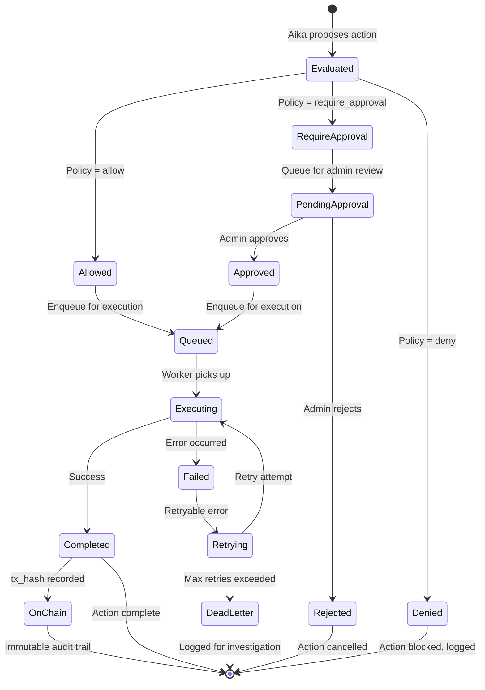
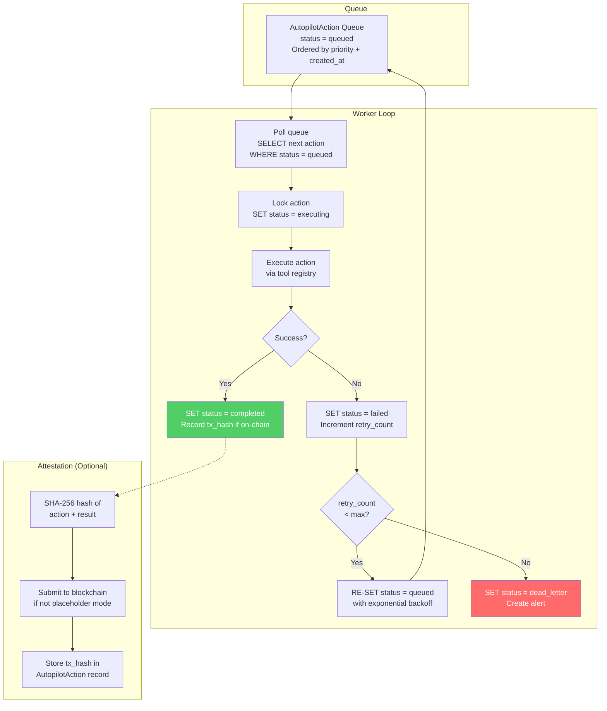

# Autopilot Architecture &amp; Policy Governance

The Aika Autopilot system enables policy-governed autonomous actions, allowing Aika to perform operational tasks (appointment booking, follow-up scheduling, check-in triggers) without human intervention — subject to configurable safety policies.

---

## Autopilot Action Lifecycle



---

## Policy Evaluation Flow

```mermaid
flowchart TD
    ACTION["Aika proposes action<br/>e.g., book_appointment,<br/>schedule_followup,<br/>trigger_checkin"] --> META["Extract action metadata<br/>action_type, risk_level,<br/>user_id, idempotency_key"]

    META --> LOOKUP["Lookup policy matrix<br/>for (action_type, risk_level)"]
    LOOKUP --> DECISION{Policy<br/>decision}

    DECISION --> |"allow"| PRE_CHECK["Pre-execution checks<br/>1. Idempotency: already executed?<br/>2. Rate limit: not too frequent?<br/>3. User consent: action permitted?"]
    DECISION --> |"require_approval"| QUEUE["Queue for admin review<br/>Create AutopilotAction<br/>status = pending_approval<br/>Notify admin dashboard"]
    DECISION --> |"deny"| BLOCK["Block action<br/>Log denial reason<br/>Return denial message to Aika"]

    PRE_CHECK --> CHECK_OK{Checks<br/>passed?}
    CHECK_OK --> |Yes| EXECUTE["Execute action<br/>via tool registry"]
    CHECK_OK --> |No (idempotent)| SKIP["Skip: already executed<br/>Return previous result"]
    CHECK_OK --> |No (rate limit)| DELAY["Delay action<br/>Schedule for later"]
    CHECK_OK --> |No (consent)| BLOCK

    EXECUTE --> EXEC_OK{Execution<br/>succeeded?}
    EXEC_OK --> |Yes| RECORD["Record result<br/>+ optional on-chain attestation"]
    EXEC_OK --> |No| RETRY_QUEUE["Queue for retry<br/>with backoff"]

    QUEUE --> ADMIN_REVIEW["Admin reviews<br/>via /admin/autopilot"]
    ADMIN_REVIEW --> |Approve| PRE_CHECK
    ADMIN_REVIEW --> |Reject| BLOCK

    style DECISION fill:#ffd93d,color:#333
    style BLOCK fill:#ff6b6b,color:#fff
    style EXECUTE fill:#51cf66,color:#fff
```

---

## Decision Matrix

### Operational Actions

| Action | LOW | MODERATE | HIGH | CRITICAL |
|--------|-----|----------|------|----------|
| `book_appointment` | allow | allow | require_approval | require_approval |
| `schedule_followup` | allow | allow | allow | require_approval |
| `trigger_checkin` | allow | allow | require_approval | deny |
| `send_resources` | allow | allow | allow | allow |
| `update_screening` | allow | allow | allow | require_approval |

### Policy-Governed Actions

| Risk \ Action | create_checkin | create_case | mint_badge | publish_attestation |
| --- | --- | --- | --- | --- |
| none | allow | deny | allow | allow |
| low | allow | deny | allow | allow |
| moderate | allow | require_approval | allow | allow |
| high | require_approval | allow | require_approval | allow |
| critical | require_approval | allow | require_approval | allow |

**Rationale:**
- `create_case` at high/critical is `allow` to preserve safety escalation latency.
- Reward-like on-chain actions (`mint_badge`) are approval-gated for high/critical.
- Audit attestations (`publish_attestation`) are always auto-allowed to preserve continuous verifiability.
- `create_case` at none/low is denied to avoid unnecessary escalation noise.

---

## Idempotency

Each action includes an idempotency key computed as:

```
idempotency_key = hash(action_type + user_id + target_resource_id + time_window)
```

This prevents duplicate execution (e.g., double-booking an appointment) even if the proposal is made multiple times due to retries or re-processing. Key uniqueness is enforced at the DB level.

### Per-Action Key Formulas (SHA-256)

| Action | Raw Key Template |
|--------|-----------------|
| `create_checkin` | `create_checkin:{user_id}:{session_id}:{date_yyyy_mm_dd}` |
| `create_case` | `create_case:{user_hash}:{session_id}:{risk_level}:{message_hash}` |
| `mint_badge` | `mint_badge:{user_id}:{chain_id}:{badge_id}:{source_event_id}` |
| `publish_attestation` | `publish_attestation:{subject_type}:{subject_id}:{payload_hash}` |

### Minimal Hashed Attestation Payload

No sensitive plaintext is written on-chain:

```json
{
 "schema_version": "v1",
 "event_type": "autopilot_action_confirmed",
 "action_id": 12345,
 "action_type": "publish_attestation",
 "subject_type": "user",
 "subject_id": "u_123",
 "risk_level": "moderate",
 "decision": "allow",
 "payload_hash": "sha256_hex",
 "evidence_hash": "sha256_hex",
 "created_at": "2026-02-16T12:00:00Z"
}
```

---

## Worker Architecture



---

## Safety Guardrails

- Critical pathways must never bypass crisis escalation logic.
- On-chain payloads must not include raw mental health text, names, emails, phone numbers, or identifiers.
- Every autonomous action must have an idempotency key and status lifecycle trace.
- Policy decision and rationale must be stored in audit logs.

---

## Verification Surfaces

| Surface | URL/API | What It Shows |
|---------|---------|---------------|
| Admin queue | `/admin/autopilot` | All actions with status, risk level, policy decision |
| Proof timeline | `/proof` | User-facing proof of actions + on-chain attestations |
| Admin API | `GET /api/v1/admin/autopilot/actions` | Full action list with filtering |
| Approve API | `POST /api/v1/admin/autopilot/actions/{id}/approve` | Approve pending action |
| Reject API | `POST /api/v1/admin/autopilot/actions/{id}/reject` | Reject pending action |
| Proof API | `GET /api/v1/proof/actions` | User-facing action proof list |
