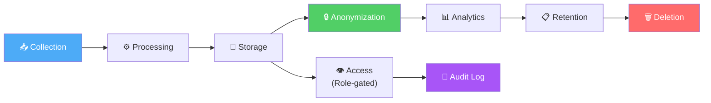
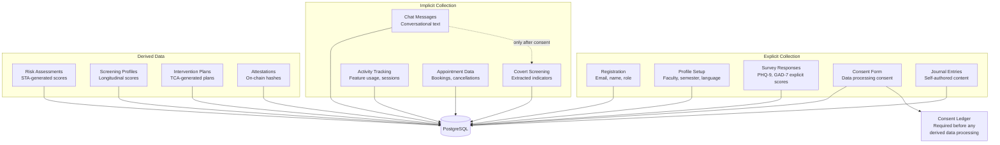
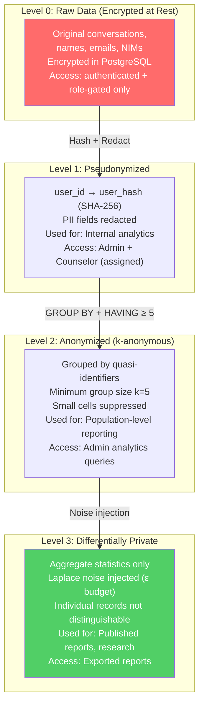
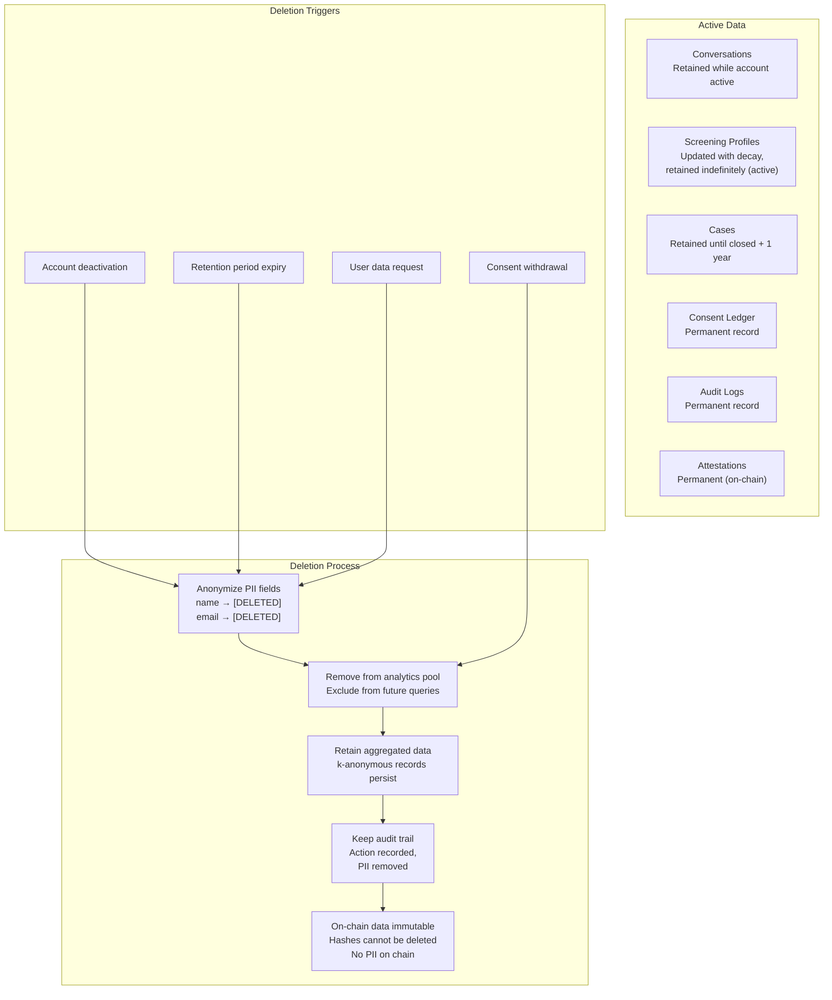
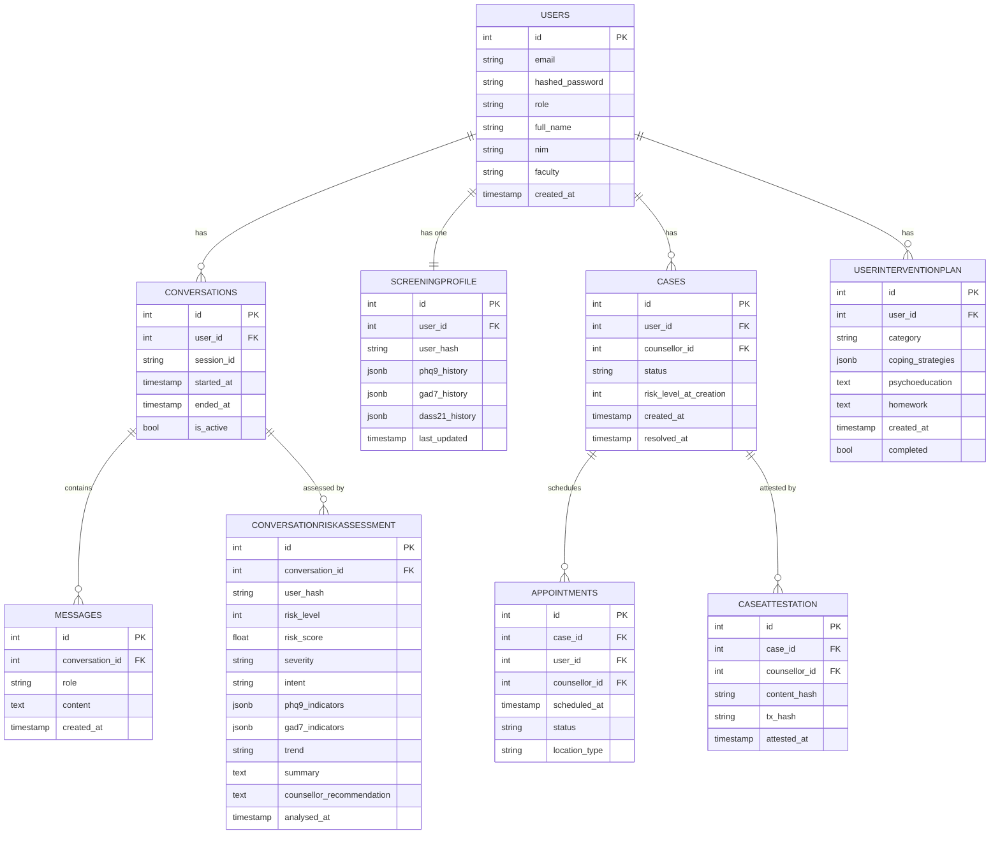

# Privacy-Preserving Analytics

This document consolidates UGM-AICare's privacy-preserving data lifecycle, anonymization architecture, consent management, database schema design, caching strategy, analytics queries, and the Insights Agent (IA) workflow into a single reference.

---

## Data Privacy Lifecycle

### Lifecycle Overview



### Data Collection Points



---

## Anonymization Levels



---

## Consent Management

### Consent State Machine

```mermaid
stateDiagram-v2
    [*] --> NoConsent: User registers
    NoConsent --> Pending: Shown consent form
    Pending --> Granted: User accepts
    Pending --> Declined: User declines
    Granted --> Withdrawn: User withdraws consent
    Withdrawn --> Granted: User re-grants
    Declined --> Granted: User later accepts

    state Granted {
        [*] --> ActiveProcessing
        ActiveProcessing --> AnalyticsIncluded: Data in analytics pool
        ActiveProcessing --> ScreeningActive: STA processes conversations
    }

    state Withdrawn {
        [*] --> ProcessingStopped
        ProcessingStopped --> AnonymizationQueued: Existing data anonymized
    }

    note right of Granted: All derived data processing enabled
    note right of Withdrawn: No new processing;<br/>existing data retained but<br/>excluded from analytics
```



### Data Retention &amp; Deletion



### Privacy Controls Summary

| Control | Mechanism | Scope | Enforcement Point |
|---------|-----------|-------|-------------------|
| **PII Redaction** | Regex-based replacement | All conversation text before analytics | STA `apply_redaction_node` |
| **Pseudonymization** | SHA-256 hashing (user_id → user_hash) | Analytics data layer | IA query builder |
| **k-Anonymity** | GROUP BY + HAVING COUNT ≥ 5 | All population queries | IA `apply_k_anonymity_node` |
| **Differential Privacy** | Laplace noise injection (ε budget) | Aggregate statistics | IA post-processing |
| **Consent Enforcement** | UserConsentLedger check | All analytics processing | IA `validate_consent_node` |
| **Role-Based Access** | JWT + RBAC middleware | All API endpoints | FastAPI middleware |
| **Encryption at Rest** | PostgreSQL encryption | Database storage | Infrastructure layer |
| **Audit Logging** | UserAuditLog + LangGraphAlert | All data access events | Middleware + agent tracker |
| **On-chain Immutability** | Smart contract hashes | Attestation records | Blockchain domain |

---

## Database Schema &amp; Privacy Design

### Core Tables (ER Diagram)

UGM-AICare uses PostgreSQL hosted on Supabase. All schema migrations are managed via **Alembic** — never modify the database schema directly.



### Privacy Design in the Schema

The schema employs a **pseudonymization pattern**. The `CONVERSATIONRISKASSESSMENT` and `SCREENINGPROFILE` tables store a `user_hash` instead of a `user_id` in columns used for analytics:

- `user_hash` is a one-way HMAC-SHA256 hash of the `user_id` with a server-side secret.
- Analytics queries (IA layer) operate only on `user_hash` — they never join against the `USERS` table.
- Only the clinical layer (CMA, counselor dashboard) performs the reverse lookup from `user_hash` to `user_id`, and only for users with the appropriate role.

Even if the analytics tables are somehow accessed without authorization, they cannot be directly linked to identifiable user records.

---

## Redis Caching

| Cache Key Pattern | Content | TTL |
| --- | --- | --- |
| `conv:{session_id}:history` | Last 10 turns of conversation | 24 hours |
| `user:{user_id}:profile` | User profile object | 10 minutes |
| `counsellors:available` | Available counselors list | 5 minutes |
| `ratelimit:{user_id}:{endpoint}` | Request counter | 60 seconds |

Conversation history is the most critical cache — it avoids a database query on every message. The TTL of 24 hours covers a typical day of use; sessions inactive for longer are re-hydrated from PostgreSQL on the next message.

---

## Analytics Queries (k-anonymity Enforced)

The Insights Agent (IA) implements six privacy-preserving analytics queries. Every query enforces **k-anonymity** via `HAVING COUNT(*) >= 5` to ensure a minimum group size of 5, preventing individual identification.

### Common Privacy Features

- All queries use `:start_date` and `:end_date` parameters (max 365 days)
- Results are aggregate-only — no PII in query output
- Only allow-listed queries may execute (no arbitrary SQL)
- The IA `validate_consent_node` confirms query approval before execution

---

### 1. crisis_trend

**Purpose**: Track crisis escalations over time by severity level.

```sql
SELECT DATE(created_at) as date, COUNT(*) as crisis_count, severity,
    COUNT(DISTINCT user_hash) as unique_users_affected
FROM cases
WHERE created_at >= :start_date AND created_at < :end_date
    AND severity IN ('high', 'critical')
GROUP BY DATE(created_at), severity
HAVING COUNT(*) >= 5  -- k-anonymity
ORDER BY date DESC
```

| Output | Description |
|--------|-------------|
| Chart | Line chart of crisis cases per day |
| Table | date, crisis_count, severity, unique_users_affected |
| Privacy | Daily aggregation, minimum 5 cases per group |

---

### 2. dropoffs

**Purpose**: Session abandonment and engagement metrics.

```sql
SELECT DATE(c.created_at) as date,
    COUNT(DISTINCT c.id) as total_sessions,
    COUNT(DISTINCT CASE WHEN (msg_count <= 2) THEN c.id END) as early_dropoffs,
    ROUND((early_dropoffs / total_sessions) * 100, 2) as dropoff_percentage,
    AVG(msg_count) as avg_messages_per_conversation
FROM conversations c
LEFT JOIN (
    SELECT conversation_id, COUNT(*) as msg_count
    FROM messages
    GROUP BY conversation_id
) m ON m.conversation_id = c.id
WHERE c.created_at >= :start_date
GROUP BY DATE(c.created_at)
HAVING COUNT(DISTINCT c.id) >= 5
```

| Output | Description |
|--------|-------------|
| Chart | Bar chart (early dropoffs vs completed sessions) |
| Table | date, total_sessions, early_dropoffs, dropoff_percentage, avg_messages |
| Privacy | Minimum 5 sessions per day |
| Key Metric | Early dropoff = conversations with ≤2 messages |

---

### 3. resource_reuse

**Purpose**: Track intervention plan revisit rates and completion.

```sql
SELECT DATE(ipr.created_at) as date,
    COUNT(DISTINCT ipr.id) as total_plans_created,
    COUNT(DISTINCT ipr.user_id) as unique_users,
    COUNT(DISTINCT CASE
        WHEN ipr.last_viewed_at IS NOT NULL
            AND ipr.last_viewed_at > ipr.created_at
        THEN ipr.id
    END) as plans_revisited,
    ROUND((plans_revisited / total_plans) * 100, 2) as revisit_rate,
    AVG(ipr.completed_steps::NUMERIC / NULLIF(ipr.total_steps, 0) * 100)
        as avg_completion_percentage
FROM intervention_plan_records ipr
WHERE ipr.created_at >= :start_date AND ipr.status = 'active'
GROUP BY DATE(ipr.created_at)
HAVING COUNT(DISTINCT ipr.id) >= 5
```

| Output | Description |
|--------|-------------|
| Chart | Bar chart of intervention plans created per day |
| Table | date, total_plans_created, unique_users, plans_revisited, revisit_rate, avg_completion_percentage |
| Privacy | Minimum 5 plans per day |
| Key Metric | Revisit = last_viewed_at &gt; created_at (user returned to plan) |

---

### 4. fallback_reduction

**Purpose**: Track AI resolution rate vs human escalation.

```sql
SELECT DATE(c.created_at) as date,
    COUNT(DISTINCT c.id) as total_conversations,
    COUNT(DISTINCT CASE
        WHEN EXISTS (SELECT 1 FROM cases cs WHERE cs.conversation_id = c.id)
        THEN c.id
    END) as escalated_to_human,
    COUNT(DISTINCT CASE
        WHEN NOT EXISTS (SELECT 1 FROM cases cs WHERE cs.conversation_id = c.id)
        THEN c.id
    END) as handled_by_ai,
    ROUND((handled_by_ai / total_conversations) * 100, 2) as ai_resolution_rate
FROM conversations c
WHERE c.created_at >= :start_date
GROUP BY DATE(c.created_at)
HAVING COUNT(DISTINCT c.id) >= 5
```

| Output | Description |
|--------|-------------|
| Chart | Pie chart (AI-handled vs human escalation) |
| Table | date, total_conversations, escalated_to_human, handled_by_ai, ai_resolution_rate |
| Privacy | Minimum 5 conversations per day |
| Key Metric | Escalation = case created for conversation (CMA intervention) |

---

### 5. cost_per_helpful

**Purpose**: Calculate efficiency metrics (processing time vs successful outcomes).

```sql
SELECT DATE(ta.created_at) as date,
    COUNT(DISTINCT ta.id) as total_assessments,
    AVG(ta.processing_time_ms) as avg_processing_time_ms,
    COUNT(DISTINCT CASE
        WHEN ta.severity_level IN ('low', 'moderate')
        AND EXISTS (
            SELECT 1 FROM intervention_plan_records ipr
            WHERE ipr.user_id = ta.user_id
            AND ipr.created_at BETWEEN ta.created_at
                AND ta.created_at + INTERVAL '1 hour'
        )
        THEN ta.id
    END) as successful_interventions,
    ROUND((successful_interventions / total_assessments) * 100, 2)
        as success_rate_percentage
FROM triage_assessments ta
WHERE ta.created_at >= :start_date
GROUP BY DATE(ta.created_at)
HAVING COUNT(DISTINCT ta.id) >= 5
```

| Output | Description |
|--------|-------------|
| Chart | Gauge chart (cost per helpful outcome) |
| Table | date, total_assessments, avg_processing_time_ms, successful_interventions, success_rate_percentage |
| Privacy | Minimum 5 assessments per day |
| Key Metric | Success = low/moderate risk assessment followed by intervention plan within 1 hour |

---

### 6. coverage_windows

**Purpose**: Identify peak/low activity times (hourly heatmap).

```sql
SELECT EXTRACT(HOUR FROM c.created_at) as hour_of_day,
    EXTRACT(DOW FROM c.created_at) as day_of_week,  -- 0=Sunday, 6=Saturday
    COUNT(DISTINCT c.id) as conversation_count,
    COUNT(DISTINCT c.user_id) as unique_users,
    AVG((SELECT COUNT(*) FROM messages m
         WHERE m.conversation_id = c.id)) as avg_messages_per_conversation,
    COUNT(DISTINCT CASE
        WHEN EXISTS (
            SELECT 1 FROM triage_assessments ta
            WHERE ta.conversation_id = c.id
            AND ta.severity_level IN ('high', 'critical')
        )
        THEN c.id
    END) as high_risk_conversations
FROM conversations c
WHERE c.created_at >= :start_date
GROUP BY EXTRACT(HOUR FROM c.created_at), EXTRACT(DOW FROM c.created_at)
HAVING COUNT(DISTINCT c.id) >= 5
ORDER BY day_of_week, hour_of_day
```

| Output | Description |
|--------|-------------|
| Chart | Bar chart (conversations per hour) |
| Table | hour_of_day, day_of_week, conversation_count, unique_users, avg_messages_per_conversation, high_risk_conversations |
| Privacy | Minimum 5 conversations per hour/day group |
| Key Metric | Hourly/daily heatmap showing system activity patterns |

---

## IA Workflow

### LangGraph Pipeline

```
User Query
    ↓
ingest_query_node (validate structure, date ranges)
    ↓
validate_consent_node (check allow-listed queries)
    ↓
apply_k_anonymity_node (set k_threshold=5)
    ↓
execute_analytics_node (call InsightsAgentService.query())
    ↓
state["analytics_result"] = IAQueryResponse
    ↓
END
```

### Service Execution Flow

```python
# User request → IAQueryRequest
request = IAQueryRequest(
    question_id="crisis_trend",
    params=QueryParams(start=start_date, end=end_date)
)

# Service executes raw SQL
sql_query = ALLOWED_QUERIES[question_id]
result = await session.execute(text(sql_query), {"start_date": start, "end_date": end})
rows = result.fetchall()

# Format results
response = formatter(rows, start, end)  # → IAQueryResponse
```

### REST API Endpoint

```bash
POST /api/v1/agents/ia/query
Content-Type: application/json

{
    "question_id": "crisis_trend",
    "params": {
        "start": "2025-01-01T00:00:00Z",
        "end": "2025-02-01T00:00:00Z"
    }
}
```

### Usage Example

```python
from app.agents.ia.service import InsightsAgentService
from app.agents.ia.schemas import IAQueryRequest, QueryParams
from datetime import datetime, timedelta

end_date = datetime.now()
start_date = end_date - timedelta(days=30)

request = IAQueryRequest(
    question_id="crisis_trend",
    params=QueryParams(start=start_date, end=end_date)
)

async with AsyncSession(...) as session:
    service = InsightsAgentService(session)
    response = await service.query(request)
    # response.chart: Line chart data for Grafana
    # response.table: Raw data for CSV export
    # response.notes: Context for interpretation
```

---

## Research Implications

### Effectiveness Metrics

1. **Crisis Trend** — Demonstrates proactive crisis detection.
2. **AI Resolution Rate** — Shows platform autonomy (reduces human workload).
3. **Intervention Success** — Validates CBT-informed coaching effectiveness.

### Performance Metrics

4. **Cost Per Helpful** — Efficiency of STA → TCA workflow.
5. **Dropoff Rate** — User engagement and satisfaction proxy.
6. **Resource Reuse** — Long-term intervention value.

### System Health Metrics

7. **Coverage Windows** — Identifies service gaps (peak/low activity times).

### Privacy Preservation

- **k-anonymity (k≥5)**: Prevents re-identification attacks.
- **Differential privacy**: Implemented — every released aggregate receives calibrated Laplace noise (pure ε-DP, event-level), with a rolling epsilon budget enforced per window (see below).
- **Aggregate-only queries**: No individual user data exposure.

### Differential Privacy Implementation

The IA agent applies the **Laplace mechanism** (Dwork & Roth, §3.3) to the raw
per-group rows of every allow-listed query before any formatting, charting,
LLM interpretation, or PDF export — so all downstream artifacts are
deterministic post-processing of DP outputs and covered by the same ε.

**Privacy model & composition**

- *Unit of privacy*: one event (conversation, case, assessment record).
- *Sensitivity*: COUNT / COUNT(DISTINCT) → Δ=1; clamped SUM over `[0, U]` → Δ=U;
  averages are released as `noisy_sum / noisy_count`; ratios and differences are
  recomputed from noised components (no extra budget).
- *Parallel composition* across date/hour groups (each record lands in exactly
  one group) plus *basic composition* across the statistics within a group →
  each query execution costs exactly `DP_EPSILON_PER_QUERY`.
- *Sequential composition* across executions is enforced by a Redis-backed
  rolling budget (`dp:budget:{window}` keys): when `DP_BUDGET_LIMIT` is spent
  within `DP_BUDGET_WINDOW_HOURS`, further queries **fail closed** until the
  window rolls over.

**Configuration** (`backend/env.example`)

| Variable | Default | Meaning |
|---|---|---|
| `DP_ENABLED` | `true` | Apply Laplace noise to all IA aggregate releases |
| `DP_EPSILON_PER_QUERY` | `2.0` | ε spent per query execution |
| `DP_DELTA` | `0.0` | Pure ε-DP (Laplace) |
| `DP_BUDGET_LIMIT` | `50.0` | Maximum ε per rolling window |
| `DP_BUDGET_WINDOW_HOURS` | `24` | Budget window length |

**Observability & audit**: responses carry `privacy_metadata` (ε spent, δ,
statistics noised, budget remaining); each execution increments the
`ia_dp_epsilon_spent_total{question_id}` Prometheus counter, and refusals
increment `ia_dp_budget_exhausted_total`.

**Known limitation (honest scope)**: the guarantee is *event-level* DP.
User-level DP would additionally require per-user contribution bounding
(cap on how many events one user may contribute per window) — documented as
future work; k-anonymity groups (k≥5) currently mitigate small-group linkage.
