# The Agentic Framework

## Why Agents, Not a Single Model?

The simplest version of this system would be one AI model that reads a student's message and responds. That approach fails at scale for a specific reason: **no single model can simultaneously be an empathetic friend, a clinical risk assessor, a CBT coach, and a case manager**. Trying to combine all of these into one prompt produces a model that is mediocre at all of them.

The solution is the same one used in real clinical settings: **specialisation with coordination**. A general practitioner doesn't perform neurosurgery. They assess, then refer, then coordinate. UGM-AICare applies the same principle to AI.

---

## The Belief-Desire-Intention (BDI) Model

Each agent in the system is designed around the **BDI cognitive architecture**, a framework from academic agent theory that maps cleanly to how clinical decision-making works:

| BDI Component | What It Means | In UGM-AICare |
|---|---|---|
| **Belief** | What the agent *knows* about the world | User profile, conversation history, previously assessed risk level, active cases |
| **Desire** | What the agent *wants to achieve* | Ensure student safety, reduce distress, facilitate access to professional support |
| **Intention** | The *specific action* the agent decides to take | Run crisis triage → generate coping plan → open a case → schedule appointment |

This structure matters because it makes agent behaviour **predictable, auditable, and testable** — properties that are essential in a clinical context.

---

## The LangGraph Orchestration Graph

The system uses **LangGraph**, a library built on top of LangChain, to define the agents as a directed graph. Each node in the graph is an async Python function; edges represent conditional routing decisions.

```mermaid
flowchart TD
    START([User Message])
    AIKA[🤖 Aika Decision Node\nIntent classification + risk pre-check]
    CRISIS{Risk Level?}
    PAR[Parallel Fan-out\nTCA + CMA simultaneously]
    TCA_N[🧠 TCA Node\nTherapeutic coaching plan]
    CMA_N[📋 CMA Node\nCase & counsellor assignment]
    IA_N[📊 IA Node\nAnalytics query]
    SYNTH[Synthesis Node\nMerge sub-agent outputs]
    DIRECT[Direct Response\nEmpathetic reply]
    END_N([Response to Student])

    STA_BG([🛡️ STA — Background Task\nPost-conversation clinical analysis])

    START --> AIKA
    AIKA --> CRISIS
    CRISIS -- "HIGH / CRITICAL" --> PAR
    PAR --> TCA_N
    PAR --> CMA_N
    TCA_N --> SYNTH
    CMA_N --> SYNTH
    CRISIS -- "MODERATE" --> TCA_N
    TCA_N --> SYNTH
    CRISIS -- "ANALYTICS\n(admin/counsellor)" --> IA_N
    IA_N --> SYNTH
    CRISIS -- "LOW / CASUAL" --> DIRECT
    SYNTH --> END_N
    DIRECT --> END_N
    END_N -.->|async, non-blocking| STA_BG
```



### Reading the Graph

- **Aika** is always the first node. It acts as the router: it classifies the intent and does a fast keyword check for crisis signals.
- **High/Critical risk** triggers a **parallel fan-out** — TCA and CMA run concurrently (not sequentially) so the student gets a complete response faster.
- **Moderate risk** routes to TCA only — deep coaching support without opening a formal clinical case.
- **Analytics requests** (from counsellors or admins) reach the IA node.
- **Low risk / casual conversation** returns a direct empathetic reply from Aika without invoking sub-agents.
- **STA** is deliberately *outside* the real-time graph. It is triggered as a non-blocking background task after the conversation, so it never adds latency to the student's experience.

---

## Shared Graph State

All agents communicate through a shared `SafetyAgentState` object — a typed dictionary that flows through the graph. No agent calls another agent directly; they read from and write to this shared state.

```python
# Simplified view of what the state carries
class SafetyAgentState(TypedDict):
    # Input context
    user_id: int
    message: str
    conversation_id: int

    # STA outputs
    risk_level: int           # 0=low, 1=moderate, 2=high, 3=critical
    risk_score: float         # 0.0 – 1.0
    severity: str             # "low" | "moderate" | "high" | "critical"
    intent: str               # "casual_chat" | "crisis" | "academic_stress" …

    # TCA outputs
    intervention_plan: dict
    coping_strategies: list[str]

    # CMA outputs
    case_id: Optional[int]
    counsellor_id: Optional[int]
    appointment_scheduled: bool

    # Final
    final_response: str
```

This design means any agent can be replaced, upgraded, or tested independently — as long as it reads and writes the same fields, the rest of the graph is unaffected.

---

## Tool Calling

Aika and each sub-agent have access to a set of **tools** — functions they can invoke to fetch or modify real data. Tools are defined once in a central registry and exposed to agents via Gemini's function-calling API.

Tool access is role-scoped: a student's Aika instance can call `book_appointment` and `get_crisis_resources`, but cannot call `get_active_safety_cases` — that tool is only available to counsellor and admin roles.

```
Student Aika Tools:
  get_user_profile    get_journal_entries      get_activity_streak
  create_intervention_plan                     get_available_counselors
  suggest_appointment_times  book_appointment  cancel_appointment
  reschedule_appointment     get_crisis_resources

Counsellor Aika Tools:
  get_case_details          get_conversation_summary
  get_risk_assessment_history   trigger_conversation_analysis
  get_active_safety_cases   get_escalation_protocol

Admin Aika Tools:
  All counsellor tools  +  get_conversation_stats  +  search_conversations
```

---

## The STA's Two-Tier Analysis

The Safety Triage Agent runs at two different times with two different depths:

### Tier 1 — Real-time (inside the conversation, < 5 ms)
A fast regex check against a predefined list of crisis keywords (`"bunuh diri"`, `"kill myself"`, `"end my life"`, etc.). If any keyword matches, the risk level is immediately elevated to `HIGH` before any LLM call is made. This ensures zero latency on the most critical signal.

### Tier 2 — Post-conversation background analysis (async, 2–10 s)
After the conversation ends, the STA performs a deep clinical analysis using Gemini:
- PHQ-9, GAD-7, and DASS-21 indicator extraction (covert screening)
- Longitudinal risk trend across the student's conversation history
- Psychologist-ready summary report
- CMA referral recommendation

The results are stored in `ConversationRiskAssessment` and `ScreeningProfile` tables, visible to counsellors via the dashboard.

---

## Why This Design Avoids Common AI Pitfalls

| Common Problem | How This System Addresses It |
|---|---|
| **Hallucinated appointments** | CMA calls real database functions — appointment slots come from actual counsellor availability, not from the model's imagination |
| **Inconsistent responses at scale** | Deterministic routing guards (e.g., crisis keyword match) run before any LLM call, ensuring predictable behaviour on safety-critical paths |
| **Opaque AI decisions** | Langfuse traces every agent node invocation, every tool call, and every LLM prompt — full auditability |
| **Privacy leakage in analytics** | IA queries enforce k-anonymity at the query layer; PII is redacted before any data enters the analytics pipeline |
| **Single point of failure** | Sub-agents are invoked asynchronously. If TCA fails, CMA can still respond independently |
