# System Architecture Overview

## The Big Picture

UGM-AICare is built as a **multi-layer system** where each layer has a single, clear responsibility. Think of it like a hospital: there is a reception desk (the frontend), a coordination centre (the backend API), a team of specialist clinicians (the AI agents), and a secure records system (the database and cache). No single layer does everything.

```mermaid
graph TB
    subgraph "Users"
        STU[🎓 Student]
        CNS[👩‍⚕️ Counsellor]
        ADM[🏛️ Administrator]
    end

    subgraph "Frontend — Next.js"
        UI[Chat Interface]
        DASH[Admin & Counsellor Dashboard]
    end

    subgraph "Backend — FastAPI"
        API[REST API]
        WS[WebSocket / SSE]
        AUTH[Auth & RBAC]
    end

    subgraph "AI Agent Layer — LangGraph"
        AIKA[🤖 Aika Orchestrator]
        STA[🛡️ Safety Triage Agent]
        TCA[🧠 Therapeutic Coach Agent]
        CMA[📋 Case Management Agent]
        IA[📊 Insights Agent]
    end

    subgraph "Data Layer"
        PG[(PostgreSQL / Supabase)]
        RD[(Redis Cache)]
        S3[(Object Storage)]
    end

    subgraph "External Services"
        GEM[Google Gemini 2.5]
        LF[Langfuse Tracing]
        ETH[Ethereum / CARE Token]
    end

    STU --> UI
    CNS --> DASH
    ADM --> DASH
    UI --> API
    UI --> WS
    DASH --> API
    API --> AUTH
    API --> AIKA
    AIKA --> STA
    AIKA --> TCA
    AIKA --> CMA
    AIKA --> IA
    AIKA --> GEM
    API --> PG
    API --> RD
    AIKA --> LF
    CMA --> ETH
    API --> S3
```

---

## The Three Core Layers

### 1. Frontend (What Users See)

The frontend is a **Next.js** application deployed at `aicare.sumbu.xyz`. It has two main surfaces:

- **Chat interface** — the conversational window where students talk to Aika. Responses stream in real-time via Server-Sent Events (SSE).
- **Dashboard** — a separate view for counsellors and administrators to see active cases, risk analytics, appointment schedules, and system health.

Authentication uses NextAuth.js with role-based access control (RBAC): students, counsellors, and administrators see different data.

### 2. Backend API (The Coordination Centre)

The backend is a **FastAPI** (Python) application. It handles:

- **REST endpoints** for all reads and writes to the database
- **WebSocket / SSE** for streaming chat responses back to the frontend in real-time
- **Agent invocation** — when a student sends a message, the backend constructs the context payload and invokes the Aika orchestrator graph
- **Scheduled tasks** — background jobs (e.g., post-conversation STA analysis, retention reminders)

The backend is stateless; session context lives in **Redis** and persistent data in **PostgreSQL**.

### 3. AI Agent Layer (Where the Intelligence Lives)

This is the most novel part of the system. Rather than a single monolithic AI model, UGM-AICare uses a **LangGraph-based multi-agent graph** where five distinct agents each handle a specific domain. This is detailed on the [Agentic Framework](./agentic-framework) page.

---

## Data Flow: A Message from Send to Response

Here is what happens in the time between a student pressing "send" and seeing Aika's reply:

```mermaid
sequenceDiagram
    participant S as 🎓 Student
    participant FE as Frontend
    participant API as FastAPI
    participant AIKA as Aika Orchestrator
    participant GEM as Gemini API
    participant DB as PostgreSQL
    participant REDIS as Redis

    S->>FE: Types a message
    FE->>API: POST /chat (message + session)
    API->>REDIS: Load conversation history
    API->>DB: Fetch user profile & context
    API->>AIKA: Invoke orchestrator graph
    AIKA->>AIKA: Crisis keyword check (< 5ms)
    AIKA->>GEM: Classify intent & risk
    GEM-->>AIKA: Risk level + intent
    alt Risk ≥ HIGH
        AIKA->>AIKA: Fan-out to TCA + CMA (parallel)
    else Risk = MODERATE
        AIKA->>AIKA: Invoke TCA only
    else Risk = LOW
        AIKA->>GEM: Generate empathetic reply
    end
    AIKA-->>API: Final synthesised response
    API-->>FE: Stream response via SSE
    FE-->>S: Response appears token-by-token
    API->>DB: Persist message & risk data (async)
    API->>AIKA: Trigger STA post-conversation analysis (async background task)
```

The entire path from message receipt to first token of response typically completes in **300–600 ms** for low-risk conversations.

---

## Security and Privacy Design

Privacy is not an afterthought in this system. Several mechanisms work in concert:

| Mechanism | Where Applied | What It Protects |
|---|---|---|
| **PII Redaction** | STA, before analytics | Personal names, IDs, phone numbers stripped from conversation records used for analysis |
| **k-Anonymity** | IA analytics queries | No query result reveals fewer than *k* individuals (default k=5) |
| **Differential Privacy** | IA aggregate stats | Statistical noise added to aggregates to prevent re-identification |
| **Role-Based Access Control** | API auth layer | Students cannot see other students' data; counsellors see only assigned cases |
| **On-chain Attestation** | CMA / Blockchain | Counsellor session notes anchored to Ethereum; tamper-evident audit trail |

---

## Next Steps

- Understand [how the agents are orchestrated →](./agentic-framework)
- See the [full technology stack →](./tech-stack)
- Meet [Aika, the orchestrator →](../agents/aika)
