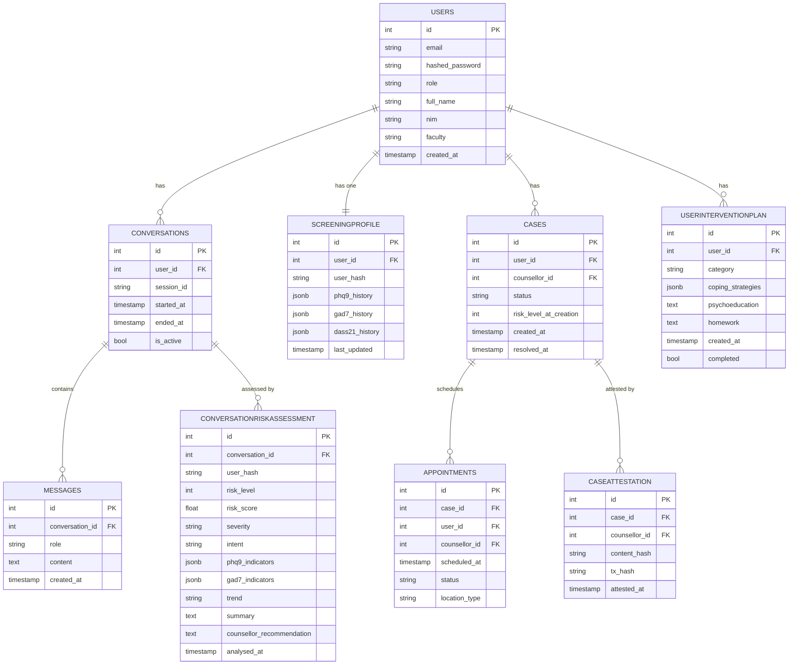

# Backend — Database Schema

## Overview

UGM-AICare uses **PostgreSQL** (hosted on Supabase) as its primary database. The schema is designed around the key entities of a mental health support system: users, conversations, risk assessments, cases, appointments, and blockchain records.

All schema migrations are managed via **Alembic**. Never modify the database schema directly; always generate a migration file.

---

## Core Tables

---

## Privacy Design in the Schema

The schema implements a **pseudonymisation** pattern:

- The `CONVERSATIONRISKASSESSMENT` and `SCREENINGPROFILE` tables store `user_hash` instead of `user_id` in the columns used for analytics.
- `user_hash` is a one-way HMAC-SHA256 hash of the `user_id` with a server-side secret.
- Analytics queries (IA layer) operate only on `user_hash` — they never join against the `USERS` table.
- Only the clinical layer (CMA, counsellor dashboard) performs the reverse lookup from `user_hash` to `user_id`, and only for users with the appropriate role.

This means even if the analytics tables are somehow accessed without authorisation, they cannot be directly linked to identifiable user records.

---

## Caching Strategy (Redis)

| Cache Key Pattern | Content | TTL |
| --- | --- | --- |
| `conv:{session_id}:history` | Last 10 turns of conversation | 24 hours |
| `user:{user_id}:profile` | User profile object | 10 minutes |
| `counsellors:available` | Available counsellors list | 5 minutes |
| `ratelimit:{user_id}:{endpoint}` | Request counter | 60 seconds |

Conversation history is the most critical cache — it avoids a database query on every message. The TTL of 24 hours covers a typical day of use; sessions inactive for longer are re-hydrated from PostgreSQL on the next message.
