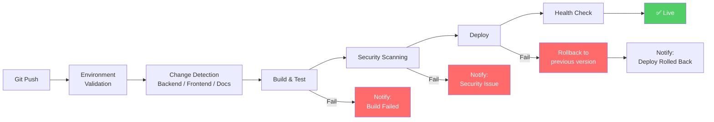
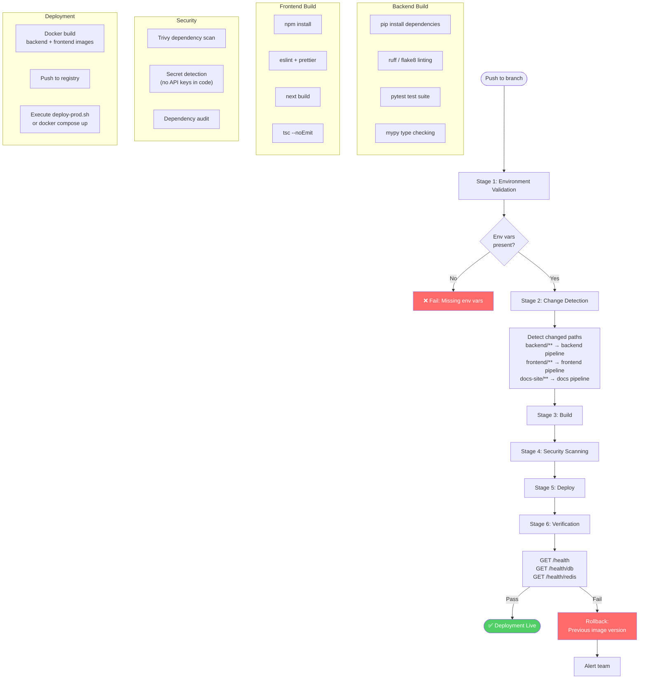
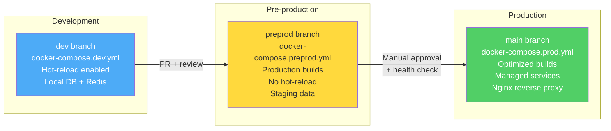
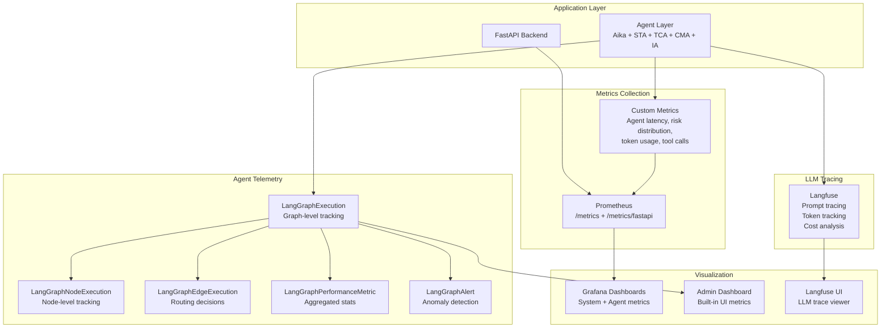
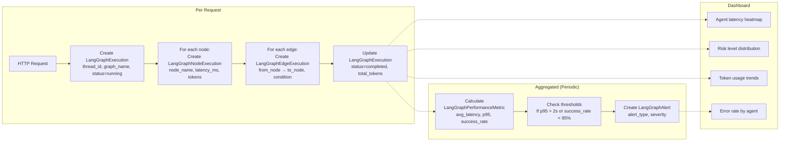
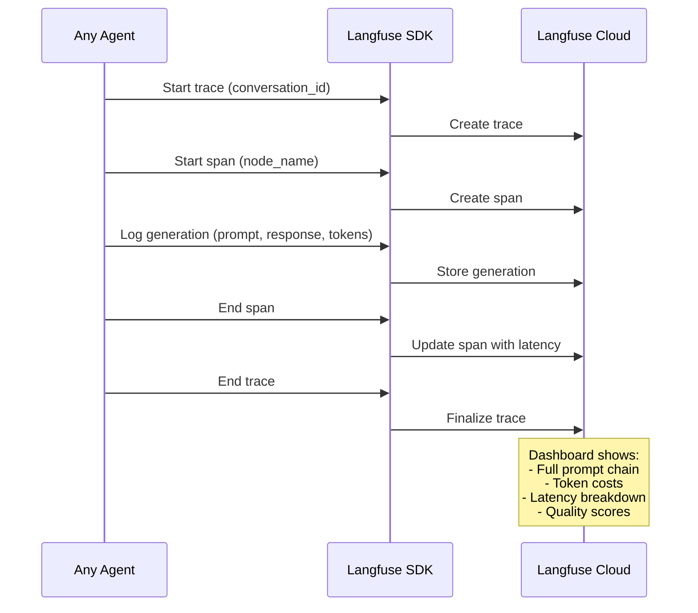

# CI/CD, Observability & Monitoring

This document consolidates the continuous integration/deployment pipeline, observability architecture, and production monitoring strategy for UGM-AICare.

---

## CI/CD Pipeline Overview



### Pipeline Visual Flow

```
┌─────────────────────────────────────────────────────────────────────┐
│ TRIGGER: Push to main                                               │
└────────────────────────────┬────────────────────────────────────────┘
                             │
          ┌────────────────────┴────────────────────┐
          │                                         │
          ▼                                         ▼
┌───────────────────┐                     ┌───────────────────┐
│ validate-env      │                     │ detect-changes    │
│ ✓ Check secrets   │                     │ ✓ Backend files   │
│ ✓ Validate vars   │                     │ ✓ Frontend files  │
└────────┬──────────┘                     └────────┬──────────┘
         │                                         │
         ▼                                         ▼
         ┌────────┐                     ┌─────────┴─────────┐
         │ PASS?  │                     │                    │
         └───┬────┘                     │                    │
             │            YES ┌──────────────┐ ┌──────────────┐
             │                │ test-backend │ │test-frontend │
             │                │ continue-on- │ │ continue-on- │
             │                │ error: true  │ │ error: true  │
             │                └──────┬───────┘ └──────┬───────┘
             │                       │                │
             │                       ▼                ▼
             │                ┌──────────────┐ ┌──────────────┐
             │                │ TESTS FAIL?  │ │ TESTS FAIL?  │
             │                └──┬───────┬───┘ └──┬───────┬───┘
             │                   │       │         │       │
             │            PASS ──┘       └── FAIL  └── FAIL
             │                   │                │
             │                   ▼                ▼
             │         ┌─────────────────────────────────┐
             │         │ Generate Test Summary            │
             │         │ • Show passed/failed counts      │
             │         │ • Display failure details         │
             │         │ • Upload artifacts                │
             │         └────────────┬────────────────────┘
             │                      │
             │         ┌────────────┴────────────┐
             │         │                         │
             ▼         ▼                         ▼
┌───────────────────┐ ┌──────────────┐ ┌──────────────┐
│ All jobs pass     │ │build-backend │ │build-frontend│
│ or continue on    │ │ Checks test  │ │ Checks test  │
│ failure           │ │ status, adds │ │ status, adds │
│                   │ │ warning if   │ │ warning if   │
│                   │ │ failed       │ │ failed       │
└─────────┬─────────┘ └──────┬───────┘ └──────┬───────┘
          │                  │                │
          │                  ▼                ▼
          │           ┌──────────────┐ ┌──────────────┐
          │           │ scan-backend │ │scan-frontend │
          │           │ Trivy scan   │ │ Trivy scan   │
          │           └──────┬───────┘ └──────┬───────┘
          │                  │                │
          └──────────────────┴────────────────┘
                             │
                             ▼
                   ┌───────────────┐
                   │ deploy        │
                   │ • Deploy app  │
                   │ • Show test   │
                   │   status      │
                   │ • Warning if  │
                   │   tests failed│
                   └───────┬───────┘
                           │
                           ▼
                   ┌───────────────┐
                   │ Summary       │
                   │ ✅ Deployed   │
                   │ ⚠️ Test       │
                   │   warnings    │
                   └───────────────┘
```

---

## Stage Details

### Stage 1: Environment Validation

**Job:** `validate-env`

| Property | Value |
|----------|-------|
| Status | MUST PASS (blocking) |
| Duration | ~30 seconds |

**Checks:**

- ENV_FILE_PRODUCTION secret exists
- All critical variables are set
- No default/example values remain
- Important variables present (warnings only)

**On Failure:** Pipeline stops immediately.

---

### Stage 2: Change Detection

**Job:** `detect-changes`

| Property | Value |
|----------|-------|
| Status | MUST PASS (blocking) |
| Duration | ~10 seconds |

**Detects:**

- Backend file changes
- Frontend file changes
- Skips tests/builds for unchanged components

**On Failure:** Pipeline stops.

---

### Stage 3: Testing (Parallel)

**Jobs:** `test-backend`, `test-frontend`

| Property | Value |
|----------|-------|
| Status | NON-BLOCKING (`continue-on-error: true`) |
| Duration | 1–3 minutes per job |

**Backend Tests:**

```bash
pytest --verbose --tb=short --junit-xml=test-results.xml
```

- Runs all pytest tests
- Generates JUnit XML report
- Captures full output
- **Continues even if tests fail**

**Frontend Tests:**

```bash
npm test -- --verbose --json --outputFile=test-results.json
```

- Runs all Jest tests
- Generates JSON report
- Captures full output
- **Continues even if tests fail**

**Outputs:**

1. **Test Summary** (GitHub Actions UI):
   - Pass/fail counts
   - Failed test names
   - Error details (first 50 lines)
   - Warning message

2. **Test Artifacts** (30-day retention):
   - `test-results.xml` / `test-results.json`
   - `test-output.txt`

**On Failure:** Job marked as failed, but pipeline continues.

---

### Stage 4: Build (Parallel)

**Jobs:** `build-backend`, `build-frontend`

| Property | Value |
|----------|-------|
| Status | Proceeds if tests passed OR failed |
| Duration | 3–5 minutes per job |

**Backend Build:**

- Checks test status from `needs.test-backend.result`
- Adds warning to summary if tests failed
- Builds Docker image
- Pushes to GHCR with commit SHA tag

**Frontend Build:**

- Checks test status from `needs.test-frontend.result`
- Adds warning to summary if tests failed
- Builds Docker image
- Pushes to GHCR with commit SHA tag

**Build Conditions:**

```yaml
if: |
  always() && 
  (needs.test-backend.result == 'success' || 
   needs.test-backend.result == 'failure' || 
   needs.test-backend.result == 'skipped')
```

**On Test Failure:** Adds this to summary:

```
⚠️ WARNING: Building despite test failures. 
Review test results before deploying.
```

---

### Stage 5: Security Scanning (Parallel)

**Jobs:** `scan-backend`, `scan-frontend`

| Property | Value |
|----------|-------|
| Status | MUST PASS (blocking) |
| Duration | 2–4 minutes per job |

**Trivy Scans:**

- Vulnerability scanning
- High/Critical severity detection
- SARIF report generation

**On Failure:** Pipeline stops (security critical).

---

### Stage 6: Deployment

**Job:** `deploy`

| Property | Value |
|----------|-------|
| Status | Final stage |
| Duration | 2–5 minutes |
| Dependencies | All previous jobs |

**Pre-Deploy Checks:**

```yaml
needs.validate-env.result == 'success' &&
(needs.build-backend.result == 'success' || 'skipped') &&
(needs.build-frontend.result == 'success' || 'skipped') &&
(needs.scan-backend.result == 'success' || 'skipped') &&
(needs.scan-frontend.result == 'success' || 'skipped')
```

**Deployment Steps:**

1. SSH to production VM
2. Pull latest code
3. Write .env file
4. Run `deploy.sh` with commit SHA
5. Optionally deploy monitoring stack

**Post-Deploy — Deployment Summary:**

```markdown
# 🚀 Deployment Summary

**Environment:** Production
**SHA:** abc123def456
**Monitoring:** true

## Test Status
- ✅ Backend Tests: PASSED
- ⚠️ Frontend Tests: FAILED (deployment continued)

## ⚠️ Warning
Deployment proceeded despite test failures. Please:
1. Review test failure details
2. Download test artifacts
3. Monitor production logs
4. Consider rollback if critical
5. Fix tests in next commit
```

**Post-Deploy — Verify Monitoring Stack** (if enabled):

- Check Prometheus health
- Check Grafana health
- Check Elasticsearch health
- Check Langfuse health

---

## Detailed Pipeline Stage Diagram



---

## Promotion Flow



### Deployment Strategy

| Environment | Branch | Command | Database |
|-------------|--------|---------|----------|
| Local Dev | `feature/*` | `docker compose -f docker-compose.base.yml -f docker-compose.dev.yml up` | Local PostgreSQL |
| Pre-production | `preprod` | `docker compose -f docker-compose.base.yml -f docker-compose.preprod.yml up` | Staging DB |
| Production | `main` | `./deploy-prod.sh` or `docker compose -f docker-compose.base.yml -f docker-compose.prod.yml up -d` | Managed PostgreSQL |

---

## Test Failure Handling

### Scenario 1: Backend Tests Fail

```
test-backend: ❌ FAILURE
    ↓ (continues anyway)
build-backend: ⚠️ BUILDS WITH WARNING
    ↓
scan-backend: ✅ PASS
    ↓
deploy: ⚠️ DEPLOYS WITH WARNING

Summary shows:
- Backend Tests: FAILED (deployment continued)
- Warning message with action items
```

### Scenario 2: Frontend Tests Fail

```
test-frontend: ❌ FAILURE
    ↓ (continues anyway)
build-frontend: ⚠️ BUILDS WITH WARNING
    ↓
scan-frontend: ✅ PASS
    ↓
deploy: ⚠️ DEPLOYS WITH WARNING

Summary shows:
- Frontend Tests: FAILED (deployment continued)
- Warning message with action items
```

### Scenario 3: Both Tests Fail

```
test-backend: ❌ FAILURE
test-frontend: ❌ FAILURE
    ↓ (both continue)
build-backend: ⚠️ BUILDS WITH WARNING
build-frontend: ⚠️ BUILDS WITH WARNING
    ↓
scan-*: ✅ PASS
    ↓
deploy: ⚠️⚠️ DEPLOYS WITH MULTIPLE WARNINGS

Summary shows:
- Backend Tests: FAILED (deployment continued)
- Frontend Tests: FAILED (deployment continued)
- Strong warning message
- Recommendation to monitor closely
```

### Scenario 4: Security Scan Fails

```
test-*: ✅ PASS
    ↓
build-*: ✅ PASS
    ↓
scan-backend: ❌ CRITICAL VULNERABILITIES
    ↓
deploy: 🚫 BLOCKED

Pipeline stops — no deployment.
Security issues must be fixed first.
```

### Accessing Test Results

**GitHub Actions UI** — Repository → Actions → Select workflow run → Summary tab.

**Download Artifacts** — Workflow run → Scroll to bottom → Artifacts section:

- `backend-test-results.zip` (test-results.xml, test-output.txt)
- `frontend-test-results.zip` (test-results.json, test-output.txt)

Retention: 30 days.

### Configuration Reference

**Make Tests Blocking** — edit `.github/workflows/ci.yml`:

```yaml
- name: Run backend tests (pytest)
  id: backend-tests
  # Remove this line to make tests blocking:
  # continue-on-error: true
  run: pytest
```

**Adjust Artifact Retention:**

```yaml
- name: Upload Backend Test Results
  uses: actions/upload-artifact@v4
  with:
    retention-days: 90  # Change from 30 to 90 days
```

**Add Critical Test Job:**

```yaml
test-critical:
  runs-on: ubuntu-latest
  steps:
    - name: Run critical tests
      run: pytest tests/critical/ --maxfail=1
      # No continue-on-error — must pass
```

---

## Rollback Procedures

### Via GitHub Actions (Recommended)

1. Go to Actions → CI/CD Pipeline
2. Click "Run workflow"
3. Select branch: `main`
4. Enter `rollback_sha`: previous-working-commit
5. Click "Run workflow"

### Via SSH (Emergency)

```bash
ssh user@production-server
cd /path/to/UGM-AICare
./deploy-prod.sh rollback abc123def456
```

### Find Previous Working SHA

```bash
# List recent commits
git log --oneline -10

# Check Actions history
# Go to Actions → Find last successful run → Copy SHA
```

### Failure Scenarios Summary

| Scenario | Detection | Response |
|----------|-----------|----------|
| Build fails | Non-zero exit from build step | Block deployment, notify via GitHub |
| Test failure | pytest / jest non-zero exit | Block deployment, report failures |
| Security vulnerability | Trivy CRITICAL finding | Block deployment, create issue |
| Health check failure | `/health` returns non-200 | Auto-rollback to previous image |
| Database migration fails | Alembic exit code | Block deployment, manual intervention |
| Docker build fails | Build step non-zero exit | Block deployment, notify |

---

## Observability Architecture

UGM-AICare implements multi-layer observability through structured logging, Prometheus metrics, Langfuse LLM tracing, and agent execution tracking.



### Agent Execution Tracking Flow



---

## Metrics (Prometheus)

### FastAPI Auto-instrumented Metrics

| Metric | Type | Description |
|--------|------|-------------|
| `http_requests_total` | Counter | Total HTTP requests by method, status, endpoint |
| `http_request_duration_seconds` | Histogram | Request latency distribution |
| `http_requests_in_progress` | Gauge | Currently processing requests |

### Custom Agent Metrics

| Metric | Type | Description |
|--------|------|-------------|
| `agent_invocation_total` | Counter | Agent invocations by agent_role, intent, routing_decision |
| `agent_latency_ms` | Histogram | Execution time per agent node |
| `agent_tokens_used` | Counter | LLM token consumption by model, agent |
| `agent_errors_total` | Counter | Errors by agent_role, error_type |
| `risk_level_distribution` | Counter | Risk level assignments (0–3) |
| `tool_call_total` | Counter | Tool invocations by tool_name, success/failure |
| `autopilot_actions_total` | Counter | Autopilot decisions by policy_result |

### Infrastructure Metrics

| Metric | Type | Description |
|--------|------|-------------|
| `agent_processing_time_seconds` | Histogram | Agent processing time by agent_name, user_role |
| `agent_invocations_total` | Counter | Total agent invocations by agent_name, user_role, intent |
| `agent_errors_total` | Counter | Total agent errors by agent_name, error_type |
| `llm_api_calls_total` | Counter | Total LLM API calls by model, success |
| `llm_api_duration_seconds` | Histogram | LLM API call duration by model |
| `llm_token_usage_total` | Counter | Total LLM tokens used by model, type |
| `tool_execution_time_seconds` | Histogram | Tool execution time by tool_name, success |
| `tool_calls_total` | Counter | Total tool calls by tool_name, success |
| `db_query_duration_seconds` | Histogram | Database query duration by operation, table |
| `db_connection_pool_size` | Gauge | Database connection pool size by pool_name |
| `active_users` | Gauge | Currently active users |
| `user_sessions_total` | Counter | Total user sessions by user_role |

### Implementation

Install Prometheus client:

```bash
cd backend
pip install prometheus-client prometheus-fastapi-instrumentator
```

Update `backend/app/main.py`:

```python
from prometheus_client import make_asgi_app
from prometheus_fastapi_instrumentator import Instrumentator

app = FastAPI(title="UGM-AICare API", ...)

# Add Prometheus metrics endpoint
metrics_app = make_asgi_app()
app.mount("/metrics", metrics_app)

# Instrument FastAPI app
Instrumentator().instrument(app).expose(app, endpoint="/metrics/fastapi")
```

Create `backend/app/core/metrics.py` with the full metric definitions and decorators:

```python
from prometheus_client import Counter, Histogram, Gauge, Info
import time
from functools import wraps
from typing import Callable

# Request metrics
http_requests_total = Counter(
    'http_requests_total',
    'Total HTTP requests',
    ['method', 'endpoint', 'status']
)

http_request_duration_seconds = Histogram(
    'http_request_duration_seconds',
    'HTTP request duration',
    ['method', 'endpoint']
)

# Agent metrics
agent_processing_time_seconds = Histogram(
    'agent_processing_time_seconds',
    'Agent processing time',
    ['agent_name', 'user_role']
)

agent_invocations_total = Counter(
    'agent_invocations_total',
    'Total agent invocations',
    ['agent_name', 'user_role', 'intent']
)

agent_errors_total = Counter(
    'agent_errors_total',
    'Total agent errors',
    ['agent_name', 'error_type']
)

# LLM metrics
llm_api_calls_total = Counter(
    'llm_api_calls_total',
    'Total LLM API calls',
    ['model', 'success']
)

llm_api_duration_seconds = Histogram(
    'llm_api_duration_seconds',
    'LLM API call duration',
    ['model']
)

llm_token_usage_total = Counter(
    'llm_token_usage_total',
    'Total LLM tokens used',
    ['model', 'type']
)

# Tool execution metrics
tool_execution_time_seconds = Histogram(
    'tool_execution_time_seconds',
    'Tool execution time',
    ['tool_name', 'success']
)

tool_calls_total = Counter(
    'tool_calls_total',
    'Total tool calls',
    ['tool_name', 'success']
)

# Intervention plan metrics
intervention_plans_created_total = Counter(
    'intervention_plans_created_total',
    'Total intervention plans created',
    ['plan_type']
)

intervention_plan_completion_rate = Gauge(
    'intervention_plan_completion_rate',
    'Intervention plan completion rate',
    ['plan_type']
)

# Crisis metrics
crisis_escalations_total = Counter(
    'crisis_escalations_total',
    'Total crisis escalations',
    ['risk_level', 'escalation_type']
)

crisis_response_time_seconds = Histogram(
    'crisis_response_time_seconds',
    'Crisis response time',
    ['risk_level']
)

# Database metrics
db_query_duration_seconds = Histogram(
    'db_query_duration_seconds',
    'Database query duration',
    ['operation', 'table']
)

db_connection_pool_size = Gauge(
    'db_connection_pool_size',
    'Database connection pool size',
    ['pool_name']
)


def track_agent_metrics(agent_name: str):
    """Decorator to track agent processing metrics."""
    def decorator(func: Callable) -> Callable:
        @wraps(func)
        async def wrapper(*args, **kwargs):
            start_time = time.time()
            try:
                result = await func(*args, **kwargs)
                user_role = kwargs.get('user_role', 'unknown')
                intent = result.get('intent', 'unknown') if isinstance(result, dict) else 'unknown'
                agent_invocations_total.labels(
                    agent_name=agent_name, user_role=user_role, intent=intent
                ).inc()
                return result
            except Exception as e:
                agent_errors_total.labels(
                    agent_name=agent_name, error_type=type(e).__name__
                ).inc()
                raise
            finally:
                duration = time.time() - start_time
                agent_processing_time_seconds.labels(
                    agent_name=agent_name,
                    user_role=kwargs.get('user_role', 'unknown')
                ).observe(duration)
        return wrapper
    return decorator


def track_tool_metrics(tool_name: str):
    """Decorator to track tool execution metrics."""
    def decorator(func: Callable) -> Callable:
        @wraps(func)
        async def wrapper(*args, **kwargs):
            start_time = time.time()
            success = True
            try:
                result = await func(*args, **kwargs)
                if isinstance(result, dict) and not result.get('success', True):
                    success = False
                return result
            except Exception:
                success = False
                raise
            finally:
                duration = time.time() - start_time
                tool_execution_time_seconds.labels(
                    tool_name=tool_name, success=str(success)
                ).observe(duration)
                tool_calls_total.labels(
                    tool_name=tool_name, success=str(success)
                ).inc()
        return wrapper
    return decorator
```

Use in agent adapters:

```python
from app.core.metrics import track_agent_metrics

class SafetyTriageAgent:
    @track_agent_metrics("STA")
    async def assess_message(self, ...):
        ...
```

---

## Monitoring Stack (ELK / Grafana)

### Logging Strategy

**Current state:** Python standard `logging` module, logs to stdout (Docker logs).

**Recommended:** ELK Stack (Elasticsearch, Logstash, Kibana).

#### Structured Logging

Create `backend/app/core/logging_config.py`:

```python
import logging
import json
import sys
from datetime import datetime
from typing import Any, Dict


class JSONFormatter(logging.Formatter):
    def format(self, record: logging.LogRecord) -> str:
        log_data: Dict[str, Any] = {
            "timestamp": datetime.utcnow().isoformat(),
            "level": record.levelname,
            "logger": record.name,
            "message": record.getMessage(),
            "module": record.module,
            "function": record.funcName,
            "line": record.lineno,
        }
        if record.exc_info:
            log_data["exception"] = self.formatException(record.exc_info)
        for attr in ("user_id", "session_id", "agent", "processing_time_ms"):
            if hasattr(record, attr):
                log_data[attr] = getattr(record, attr)
        return json.dumps(log_data)


def configure_logging(log_level: str = "INFO") -> None:
    formatter = JSONFormatter()
    console_handler = logging.StreamHandler(sys.stdout)
    console_handler.setFormatter(formatter)
    root_logger = logging.getLogger()
    root_logger.setLevel(log_level)
    root_logger.addHandler(console_handler)
    logging.getLogger("urllib3").setLevel(logging.WARNING)
    logging.getLogger("asyncio").setLevel(logging.WARNING)
    logging.getLogger("sqlalchemy.engine").setLevel(logging.WARNING)
```

Update `backend/app/main.py`:

```python
from app.core.logging_config import configure_logging
import os

LOG_LEVEL = os.getenv("LOG_LEVEL", "INFO")
configure_logging(log_level=LOG_LEVEL)
```

All application logs use structured JSON format:

```json
{
  "timestamp": "2026-04-23T14:23:11.456Z",
  "level": "INFO",
  "module": "aika.decision_node",
  "function": "aika_decision_node",
  "message": "Routing decision completed",
  "user_id": 1203,
  "conversation_id": 4812,
  "intent": "academic_stress",
  "risk_level": 1,
  "routing": "execute_sca",
  "latency_ms": 342,
  "tokens_used": 847,
  "request_id": "req_abc123"
}
```

### Log Levels

| Level | Usage |
|-------|-------|
| `DEBUG` | Detailed agent state, tool call inputs/outputs |
| `INFO` | Request processing, routing decisions, agent invocations |
| `WARNING` | Fallback activations, rate limit approaches, retry attempts |
| `ERROR` | Agent failures, LLM errors, database connection issues |
| `CRITICAL` | System startup failures, security events |

### ELK Stack Deployment

Operational note: a Compose-based ELK stack previously existed in this repository but has been removed. The following is an illustrative configuration.

```yaml
version: '3.8'

services:
  elasticsearch:
    image: docker.elastic.co/elasticsearch/elasticsearch:8.11.0
    container_name: elasticsearch
    environment:
      - discovery.type=single-node
      - "ES_JAVA_OPTS=-Xms2g -Xmx2g"
      - xpack.security.enabled=false
    ports:
      - "9200:9200"
    volumes:
      - elasticsearch-data:/usr/share/elasticsearch/data
    networks:
      - elk

  logstash:
    image: docker.elastic.co/logstash/logstash:8.11.0
    container_name: logstash
    volumes:
      - ./logstash/pipeline:/usr/share/logstash/pipeline
      - ./logstash/config/logstash.yml:/usr/share/logstash/config/logstash.yml
    ports:
      - "5000:5000/tcp"
      - "5000:5000/udp"
      - "9600:9600"
    environment:
      LS_JAVA_OPTS: "-Xmx1g -Xms1g"
    depends_on:
      - elasticsearch
    networks:
      - elk

  kibana:
    image: docker.elastic.co/kibana/kibana:8.11.0
    container_name: kibana
    ports:
      - "5601:5601"
    environment:
      ELASTICSEARCH_HOSTS: http://elasticsearch:9200
    depends_on:
      - elasticsearch
    networks:
      - elk

  filebeat:
    image: docker.elastic.co/beats/filebeat:8.11.0
    container_name: filebeat
    user: root
    volumes:
      - ./filebeat/filebeat.yml:/usr/share/filebeat/filebeat.yml:ro
      - /var/lib/docker/containers:/var/lib/docker/containers:ro
      - /var/run/docker.sock:/var/run/docker.sock:ro
    depends_on:
      - logstash
    networks:
      - elk

volumes:
  elasticsearch-data:
    driver: local

networks:
  elk:
    driver: bridge
```

**Filebeat configuration** (`filebeat/filebeat.yml`):

```yaml
filebeat.inputs:
  - type: container
    paths:
      - '/var/lib/docker/containers/*/*.log'
    processors:
      - add_docker_metadata:
          host: "unix:///var/run/docker.sock"
      - decode_json_fields:
          fields: ["message"]
          target: "json"
          overwrite_keys: true

output.logstash:
  hosts: ["logstash:5000"]
```

**Logstash pipeline** (`logstash/pipeline/logstash.conf`):

```conf
input {
  beats { port => 5000 }
}

filter {
  if [json][message] {
    json {
      source => "[json][message]"
      target => "app"
    }
  }
  if [app][agent] {
    mutate { add_field => { "agent_name" => "%{[app][agent]}" } }
  }
  if [app][processing_time_ms] {
    mutate { convert => { "[app][processing_time_ms]" => "float" } }
  }
}

output {
  elasticsearch {
    hosts => ["elasticsearch:9200"]
    index => "ugm-aicare-%{+YYYY.MM.dd}"
  }
}
```

Access Kibana at `http://localhost:5601`.

### Prometheus + Grafana Deployment

Operational note: a Compose-based monitoring stack previously existed in this repository but has been removed. The following is an illustrative configuration.

```yaml
version: '3.8'

services:
  prometheus:
    image: prom/prometheus:latest
    container_name: prometheus
    ports:
      - "9090:9090"
    volumes:
      - ./prometheus/prometheus.yml:/etc/prometheus/prometheus.yml
      - prometheus-data:/prometheus
    command:
      - '--config.file=/etc/prometheus/prometheus.yml'
      - '--storage.tsdb.path=/prometheus'
    networks:
      - monitoring

  grafana:
    image: grafana/grafana:latest
    container_name: grafana
    ports:
      - "3000:3000"
    environment:
      - GF_SECURITY_ADMIN_PASSWORD=admin123
      - GF_USERS_ALLOW_SIGN_UP=false
    volumes:
      - grafana-data:/var/lib/grafana
      - ./grafana/dashboards:/etc/grafana/provisioning/dashboards
      - ./grafana/datasources:/etc/grafana/provisioning/datasources
    depends_on:
      - prometheus
    networks:
      - monitoring

  node-exporter:
    image: prom/node-exporter:latest
    container_name: node-exporter
    ports:
      - "9100:9100"
    networks:
      - monitoring

  cadvisor:
    image: gcr.io/cadvisor/cadvisor:latest
    container_name: cadvisor
    ports:
      - "8080:8080"
    volumes:
      - /:/rootfs:ro
      - /var/run:/var/run:ro
      - /sys:/sys:ro
      - /var/lib/docker/:/var/lib/docker:ro
    networks:
      - monitoring

volumes:
  prometheus-data:
  grafana-data:

networks:
  monitoring:
    driver: bridge
```

**Prometheus configuration** (`prometheus/prometheus.yml`):

```yaml
global:
  scrape_interval: 15s
  evaluation_interval: 15s

scrape_configs:
  - job_name: 'ugm-aicare-backend'
    static_configs:
      - targets: ['backend:8000']
    metrics_path: '/metrics'

  - job_name: 'node-exporter'
    static_configs:
      - targets: ['node-exporter:9100']

  - job_name: 'cadvisor'
    static_configs:
      - targets: ['cadvisor:8080']

  - job_name: 'postgres'
    static_configs:
      - targets: ['postgres-exporter:9187']

  - job_name: 'redis'
    static_configs:
      - targets: ['redis-exporter:9121']

rule_files:
  - 'alert_rules.yml'
```

### Production Deployment Architecture

```text
                    ┌─────────────────┐
                    │  Load Balancer  │
                    │    (Nginx)      │
                    └────────┬────────┘
                             │
          ┌──────────────────┼──────────────────┐
          │                  │                  │
    ┌─────▼─────┐    ┌──────▼─────┐    ┌──────▼─────┐
    │ Backend 1 │    │ Backend 2  │    │ Backend 3  │
    │ (FastAPI) │    │ (FastAPI)  │    │ (FastAPI)  │
    └─────┬─────┘    └──────┬─────┘    └──────┬─────┘
          │                  │                  │
          └──────────────────┼──────────────────┘
                             │
               ┌─────────────┴─────────────┐
               │                           │
         ┌─────▼─────┐              ┌──────▼──────┐
         │ PostgreSQL │              │   Redis     │
         │ (Primary)  │              │   (Cache)   │
         └─────┬──────┘              └─────────────┘
               │
         ┌─────▼──────┐
         │ PostgreSQL  │
         │  (Replica)  │
         └─────────────┘
```

---

## Alert Rules

Create Prometheus alert rules (`prometheus/alert_rules.yml`):

```yaml
groups:
  - name: ugm_aicare_alerts
    interval: 30s
    rules:
      - alert: HighErrorRate
        expr: rate(http_requests_total{status=~"5.."}[5m]) > 0.05
        for: 5m
        labels:
          severity: critical
        annotations:
          summary: "High error rate detected"
          description: "Error rate is {{ $value }} per second"

      - alert: SlowResponseTime
        expr: histogram_quantile(0.95, rate(http_request_duration_seconds_bucket[5m])) > 2
        for: 5m
        labels:
          severity: warning
        annotations:
          summary: "Slow API response time"
          description: "P95 latency is {{ $value }} seconds"

      - alert: SlowAgentProcessing
        expr: histogram_quantile(0.95, rate(agent_processing_time_seconds_bucket[5m])) > 5
        for: 5m
        labels:
          severity: warning
        annotations:
          summary: "Slow agent processing detected"
          description: "{{ $labels.agent_name }} P95 time is {{ $value }} seconds"

      - alert: CrisisEscalationBacklog
        expr: rate(crisis_escalations_total[5m]) > 10
        for: 2m
        labels:
          severity: critical
        annotations:
          summary: "High crisis escalation rate"
          description: "{{ $value }} crisis escalations per second"

      - alert: DatabaseConnectionPoolLow
        expr: db_connection_pool_size < 5
        for: 2m
        labels:
          severity: warning
        annotations:
          summary: "Database connection pool running low"
          description: "Only {{ $value }} connections available"

      - alert: HighMemoryUsage
        expr: (node_memory_MemTotal_bytes - node_memory_MemAvailable_bytes) / node_memory_MemTotal_bytes > 0.9
        for: 5m
        labels:
          severity: warning
        annotations:
          summary: "High memory usage"
          description: "Memory usage is {{ $value | humanizePercentage }}"

      - alert: ContainerDown
        expr: up == 0
        for: 1m
        labels:
          severity: critical
        annotations:
          summary: "Container {{ $labels.instance }} is down"
          description: "{{ $labels.job }} has been down for more than 1 minute"
```

### Alertmanager Configuration

```yaml
global:
  resolve_timeout: 5m

route:
  group_by: ['alertname', 'cluster']
  group_wait: 10s
  group_interval: 10s
  repeat_interval: 12h
  receiver: 'team-notifications'
  routes:
    - match:
        severity: critical
      receiver: 'critical-alerts'
      continue: true
    - match:
        severity: warning
      receiver: 'warning-alerts'

receivers:
  - name: 'team-notifications'
    slack_configs:
      - api_url: 'YOUR_SLACK_WEBHOOK_URL'
        channel: '#ugm-aicare-alerts'
        title: 'UGM-AICare Alert'
        text: '{{ range .Alerts }}{{ .Annotations.description }}{{ end }}'

  - name: 'critical-alerts'
    slack_configs:
      - api_url: 'YOUR_SLACK_WEBHOOK_URL'
        channel: '#ugm-aicare-critical'
        title: '🚨 CRITICAL: UGM-AICare'
        text: '{{ range .Alerts }}{{ .Annotations.description }}{{ end }}'
    pagerduty_configs:
      - service_key: 'YOUR_PAGERDUTY_KEY'

  - name: 'warning-alerts'
    slack_configs:
      - api_url: 'YOUR_SLACK_WEBHOOK_URL'
        channel: '#ugm-aicare-warnings'
        title: '⚠️ Warning: UGM-AICare'
        text: '{{ range .Alerts }}{{ .Annotations.description }}{{ end }}'

inhibit_rules:
  - source_match:
      severity: 'critical'
    target_match:
      severity: 'warning'
    equal: ['alertname', 'cluster']
```

---

## Mental Health Metrics

### Custom Metrics for the Mental Health Platform

```python
# Crisis Response Metrics
crisis_response_time_by_counselor = Histogram(
    'crisis_response_time_by_counselor_seconds',
    'Time taken by counselor to respond to crisis',
    ['counselor_id', 'risk_level']
)

# User Engagement Metrics
daily_active_users = Gauge(
    'daily_active_users',
    'Number of daily active users'
)

user_session_duration_seconds = Histogram(
    'user_session_duration_seconds',
    'User session duration',
    ['user_role']
)

# Intervention Effectiveness
intervention_plan_steps_completed = Counter(
    'intervention_plan_steps_completed_total',
    'Total intervention plan steps completed',
    ['plan_type', 'step_number']
)

intervention_plan_abandonment_rate = Gauge(
    'intervention_plan_abandonment_rate',
    'Rate of abandoned intervention plans',
    ['plan_type']
)

# Therapeutic Outcomes
mood_improvement_score = Gauge(
    'mood_improvement_score',
    'Average mood improvement score',
    ['intervention_type']
)

# Safety Metrics
safety_triage_accuracy = Gauge(
    'safety_triage_accuracy',
    'Accuracy of safety triage assessment',
    ['risk_level']
)

false_positive_rate = Gauge(
    'false_positive_crisis_rate',
    'Rate of false positive crisis detections'
)

# Counselor Performance
counselor_case_load = Gauge(
    'counselor_case_load',
    'Number of active cases per counselor',
    ['counselor_id']
)

counselor_response_satisfaction = Gauge(
    'counselor_response_satisfaction_score',
    'User satisfaction with counselor response',
    ['counselor_id']
)
```

### Business Metrics (Mental Health Specific)

| Metric | Description |
|--------|-------------|
| Active Users | Daily/Weekly/Monthly active users |
| Crisis Escalations | Count and response time |
| Intervention Plan Completion | Success rate |
| Counselor Response Time | Average time to respond |
| User Retention | 7-day, 30-day retention |

---

## Langfuse Integration



### What Langfuse Tracks

| Entity | Fields Tracked |
|--------|---------------|
| **Trace** | conversation_id, user_id, agent_version, total_tokens, total_cost |
| **Span** | node_name, agent_role, input/output tokens, latency_ms |
| **Generation** | model, prompt_template, completion, temperature, token counts |
| **Event** | tool_name, tool_args, tool_result, success/failure |

---

## Dashboards

### Grafana Dashboard

Save as `grafana/dashboards/ugm-aicare-overview.json`:

```json
{
  "dashboard": {
    "title": "UGM-AICare Production Overview",
    "panels": [
      {
        "title": "Request Rate",
        "targets": [
          { "expr": "rate(http_requests_total[5m])", "legendFormat": "{{method}} {{endpoint}}" }
        ]
      },
      {
        "title": "Response Time (P95)",
        "targets": [
          { "expr": "histogram_quantile(0.95, rate(http_request_duration_seconds_bucket[5m]))", "legendFormat": "P95" }
        ]
      },
      {
        "title": "Agent Processing Time",
        "targets": [
          { "expr": "rate(agent_processing_time_seconds_sum[5m]) / rate(agent_processing_time_seconds_count[5m])", "legendFormat": "{{agent_name}}" }
        ]
      },
      {
        "title": "Crisis Escalations",
        "targets": [
          { "expr": "rate(crisis_escalations_total[5m])", "legendFormat": "{{risk_level}}" }
        ]
      },
      {
        "title": "Intervention Plans Created",
        "targets": [
          { "expr": "rate(intervention_plans_created_total[1h])", "legendFormat": "{{plan_type}}" }
        ]
      },
      {
        "title": "Active Users",
        "targets": [
          { "expr": "active_users", "legendFormat": "Active Users" }
        ]
      }
    ]
  }
}
```

Access Grafana at `http://your-server:3000` (default credentials: `admin / admin123`).

---

## Practical Monitoring Commands

### View Logs in Production

```bash
docker compose logs -f                          # Real-time logs from all containers
docker compose logs -f backend                  # Logs from specific service
docker compose logs --tail=100 backend           # Last 100 lines
docker compose logs backend | grep -i error      # Search logs for errors
docker compose logs -f -t backend                # Follow logs with timestamp
docker compose logs --no-color backend > backend-logs.txt  # Export logs
```

### Query Prometheus Metrics

```bash
curl http://localhost:9090/api/v1/query?query=up
curl 'http://localhost:9090/api/v1/query?query=rate(http_requests_total{status=~"5.."}[5m])'
curl 'http://localhost:9090/api/v1/query?query=agent_processing_time_seconds'
```

### Kibana Log Queries

```text
level: ERROR
app.agent: "aika::sca" AND app.processing_time_ms: >5000
message: "crisis" AND app.risk_level: "critical"
message: "intervention plan created"
```

---

## Test Health Monitoring

### Key Metrics

1. **Test Pass Rate** — % of runs with all tests passing. Target: &gt;95%
2. **Test Execution Time** — Average duration per job. Watch for slowdowns.
3. **Failure Recovery Time** — Time from failure to fix. Target: &lt;24 hours.
4. **Artifact Download Rate** — How often devs download artifacts for investigation.

### Best Practices

**DO:**

- Review test summaries after every deployment
- Download artifacts for investigation
- Fix failing tests within 24 hours
- Monitor production after deploying with failures
- Keep tests fast (&lt;3 minutes)

**DON'T:**

- Ignore test failures
- Let broken tests accumulate
- Deploy without checking summary
- Skip artifact review for complex failures
- Disable tests instead of fixing them

---

## Cost Estimation

| Approach | Cost |
|----------|------|
| Self-hosted ELK + Prometheus + Grafana | $60–250/month |
| Managed services (DataDog, NewRelic) | $300–1000/month |

---

## Quick Start Checklist

- [ ] Enable structured JSON logging
- [ ] Deploy ELK stack for log aggregation
- [ ] Deploy Prometheus + Grafana for metrics
- [ ] Configure alert rules for critical metrics
- [ ] Set up Slack/email notifications
- [ ] Create custom dashboards for mental health metrics
- [ ] Test alerting system with simulated failures
- [ ] Document runbook for common incidents
- [ ] Train team on using Kibana and Grafana
- [ ] Set up automated backups for metrics/logs

---

**Resources:**

- [ELK Stack Docs](https://www.elastic.co/guide/)
- [Prometheus Docs](https://prometheus.io/docs/)
- [Grafana Docs](https://grafana.com/docs/)
- [FastAPI Prometheus Instrumentator](https://github.com/trallnag/prometheus-fastapi-instrumentator)

**Maintained By:** UGM-AICare DevOps Team
