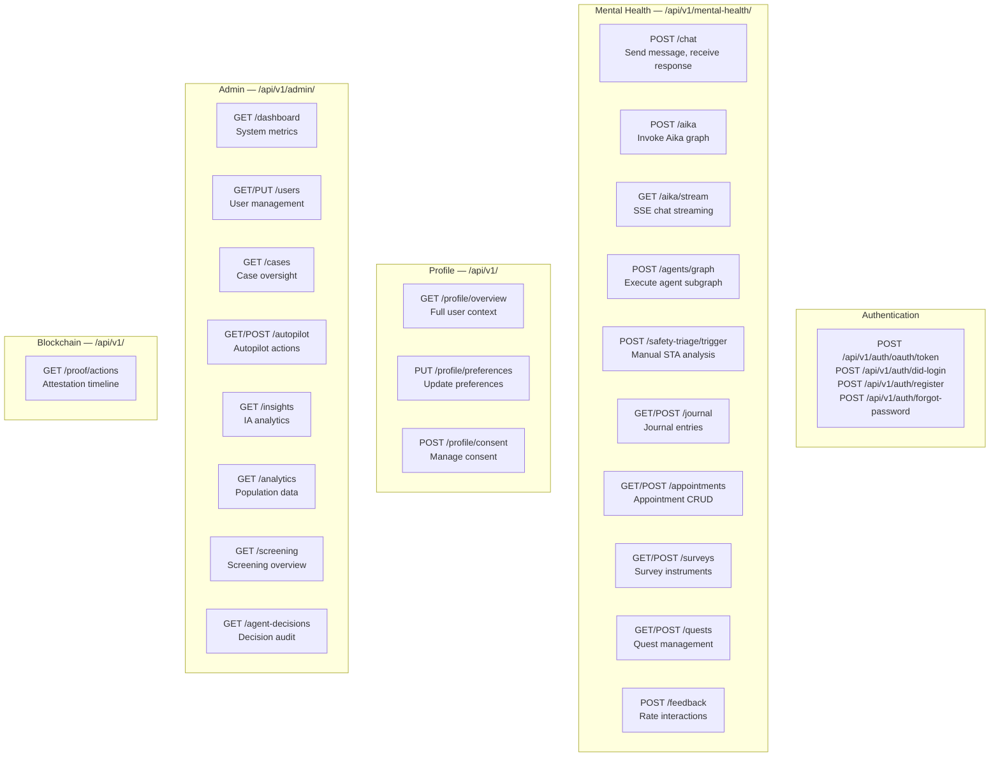
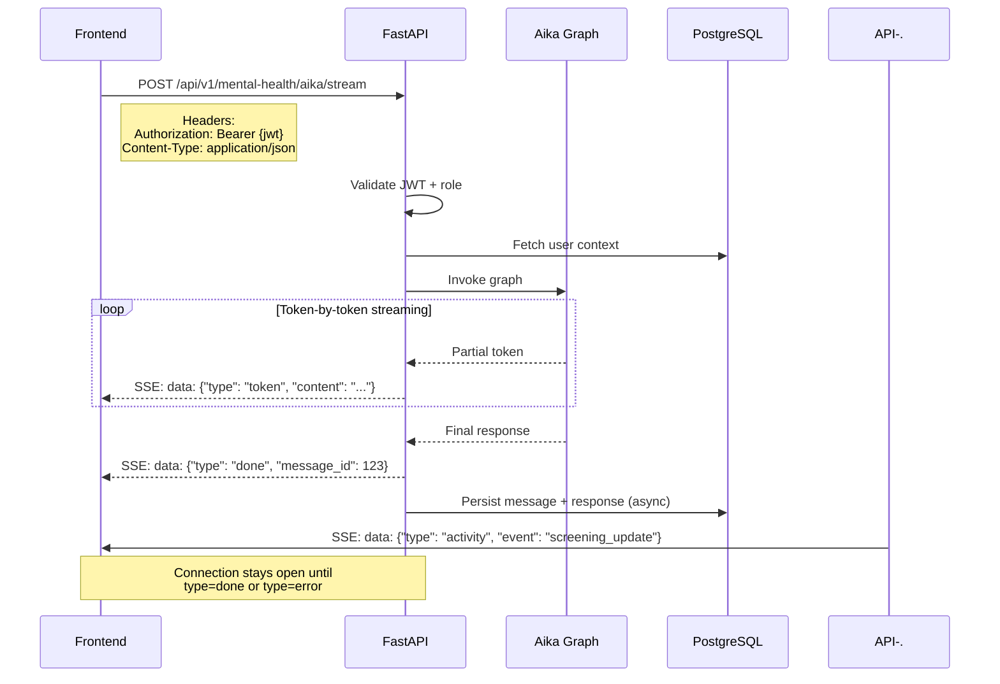

# API Reference & Data Contracts

## Architecture Overview

The backend is a **FastAPI** application organised around Domain-Driven Design (DDD): each business domain lives in its own directory with its own routes, schemas, services, and models.

```
backend/app/
├── agents/                # All AI agent graphs and logic
│   ├── aika/              # Aika identity, tools, activity logger
│   ├── sta/               # Safety Triage Agent graph
│   ├── tca/               # Therapeutic Coach Agent graph
│   ├── cma/               # Case Management Agent graph
│   ├── ia/                # Insights Agent graph
│   └── shared/            # Tool registry, shared utilities
├── domains/
│   ├── mental_health/     # Appointments, cases, conversations
│   ├── finance/           # CARE token, blockchain
│   └── blockchain/        # Contract interaction layer
├── auth_utils.py          # JWT verification, role extraction
├── dependencies.py        # FastAPI dependency injection
├── main.py                # Application entrypoint, router registration
└── middleware/             # Rate limiting, CORS, logging
```

---

## Authentication

All API endpoints (except `/health` and auth endpoints) require a **JWT bearer token**. Tokens are issued by `/auth/login` and verified on every request via the `verify_token` dependency.

All authenticated requests require one of:

```
Authorization: Bearer <jwt_access_token>
Cookie: access_token=<jwt_access_token>; HttpOnly; Secure; SameSite=Lax
```

The `role` field in the JWT payload determines which API endpoints are accessible and which Aika tools are available.

---

## API Route Groups



---

## SSE Streaming Contract

The primary interaction pattern for student chat uses Server-Sent Events.



### SSE Event Types

| Event Type | Payload | Description |
|-----------|---------|-------------|
| `token` | `{ "type": "token", "content": "word" }` | Individual response tokens |
| `done` | `{ "type": "done", "message_id": int }` | Response complete |
| `error` | `{ "type": "error", "message": "..." }` | Error during generation |
| `activity` | `{ "type": "activity", "event": "..." }` | Background event notification |
| `tool_call` | `{ "type": "tool_call", "tool": "..." }` | Agent executing a tool |

---

## Core Endpoints

### Chat

| Method | Path | Description |
| --- | --- | --- |
| `POST` | `/api/v1/aika` | Send a message and receive SSE stream response |
| `GET` | `/api/v1/history` | Fetch authenticated user's conversation history |

### Appointments

| Method | Path | Description |
| --- | --- | --- |
| `GET` | `/api/v1/appointments` | List user's appointments |
| `POST` | `/api/v1/appointments` | Create new appointment |
| `PATCH` | `/api/v1/appointments/{id}` | Reschedule or cancel |

### Cases (Counsellor/Admin only)

| Method | Path | Description |
| --- | --- | --- |
| `GET` | `/api/v1/cases` | List all active cases |
| `GET` | `/api/v1/cases/{id}` | Get case details |
| `PATCH` | `/api/v1/cases/{id}/status` | Update case status |
| `POST` | `/api/v1/cases/{id}/attest` | Submit blockchain attestation |

### Analytics (Admin/Counsellor only)

| Method | Path | Description |
| --- | --- | --- |
| `GET` | `/api/v1/analytics/risk-trends` | Population risk trend data |
| `GET` | `/api/v1/analytics/screening` | Aggregate screening indicators |
| `GET` | `/api/v1/analytics/intervention-funnel` | Stage funnel metrics |

### STA (Manual triggers — Counsellor/Admin only)

| Method | Path | Description |
| --- | --- | --- |
| `POST` | `/api/v1/admin/conversation-assessments/{conversation_id}/trigger` | Manually trigger STA analysis |
| `GET` | `/api/v1/admin/conversation-assessments/{conversation_id}` | Fetch STA report for a conversation |

---

## Rate Limiting

API endpoints are rate-limited via Redis to prevent abuse:

| Endpoint Group | Limit | Window |
| --- | --- | --- |
| Chat (`/aika`, `/chat`) | 20 requests | Per minute per user |
| Auth (`/auth/*`) | 5 requests | Per minute per IP |
| Admin (`/admin/*`) | 60 requests | Per minute per user |
| STA manual trigger | 3 requests | Per minute per user |
| General API | 100 requests | Per minute per user |

Rate limit headers (`X-RateLimit-Limit`, `X-RateLimit-Remaining`, `X-RateLimit-Reset`) are included in every response.

---

## Error Codes

All errors follow a consistent JSON structure:

```json
{
  "detail": {
    "code": "RATE_LIMIT_EXCEEDED",
    "message": "Rate limit exceeded. Retry after 60 seconds.",
    "status": 429
  }
}
```

| Code | HTTP Status | Description |
| --- | --- | --- |
| `UNAUTHORIZED` | 401 | Invalid or missing JWT |
| `FORBIDDEN` | 403 | Insufficient role permissions |
| `NOT_FOUND` | 404 | Resource not found |
| `RATE_LIMIT_EXCEEDED` | 429 | Too many requests |
| `VALIDATION_ERROR` | 422 | Request body validation failed |
| `LLM_ERROR` | 502 | LLM provider returned an error |
| `LLM_RATE_LIMIT` | 503 | LLM provider rate limit hit |
| `INTERNAL_ERROR` | 500 | Unexpected server error |

---

## JWT Payload

```json
{
  "sub": "1203",
  "role": "user",
  "email": "student@mail.ugm.ac.id",
  "exp": 1740700000,
  "iat": 1739996400,
  "type": "access"
}
```
