# Technology Stack & Development

UGM-AICare is built as a layered architecture. The guiding principle is **pragmatic simplicity**: production-proven, well-documented technologies suited to a small team.

---

## Layered Architecture

```mermaid
graph TB
    subgraph "Layer 1: Presentation"
        direction LR
        NEXT["Next.js 16<br/>TypeScript 5<br/>Tailwind CSS 4<br/>Framer Motion"]
        AUTH_FE["NextAuth.js v5<br/>Session management"]
        WEB3["wagmi + RainbowKit<br/>Wallet connections"]
        SSE_FE["SSE Client<br/>Real-time streaming"]
    end

    subgraph "Layer 2: API Gateway"
        direction LR
        FAST["FastAPI<br/>Python 3.9+"]
        PYDANTIC["Pydantic v2<br/>Request validation"]
        JWT["python-jose<br/>JWT authentication"]
        PROM["prometheus-fastapi<br/>Metrics collection"]
    end

    subgraph "Layer 3: Agent Orchestration"
        direction LR
        LG["LangGraph<br/>StateGraph + Conditional Edges"]
        TOOLS["Tool Registry<br/>@register_tool decorator"]
        CHECK["AsyncPostgresSaver<br/>Graph checkpointing"]
        TRACK["Execution Tracker<br/>Node-level telemetry"]
    end

    subgraph "Layer 4: Intelligence"
        direction LR
        GEM["Google Gemini 2.5<br/>Primary LLM"]
        FLASH["Gemini Flash<br/>Fast responses"]
        PRO["Gemini Pro<br/>Complex reasoning"]
        ZAI["Z.AI / OpenRouter<br/>Fallback providers"]
        LF["Langfuse<br/>LLM observability"]
    end

    subgraph "Layer 5: Domain Services"
        direction LR
        MH["Mental Health Domain<br/>Chat, Screening, Cases"]
        BLK["Blockchain Domain<br/>Tokens, NFTs, Attestation"]
        FIN["Finance Domain<br/>Revenue, Staking"]
        USR["User Domain<br/>Auth, Profiles, Preferences"]
    end

    subgraph "Layer 6: Data & Infrastructure"
        direction LR
        PG["PostgreSQL<br/>Primary data store<br/>+ Alembic migrations"]
        RED["Redis<br/>Cache + Rate limiting"]
        OBJ["S3-Compatible Storage<br/>Avatars, media"]
        SCHED["APScheduler<br/>Background jobs"]
        DOCKER["Docker Compose<br/>Container orchestration"]
        NGINX["Nginx<br/>Reverse proxy + SSL"]
    end

    subgraph "Layer 7: Blockchain"
        direction LR
        SOMNIA["SOMNIA Chain<br/>CARE Token + Staking"]
        EDU["EDU Chain<br/>NFT Achievement Badges"]
        BNB["BNB Smart Chain<br/>NFT Badges (alternate)"]
        WEB3PY["web3.py<br/>Blockchain client"]
        OZ["OpenZeppelin<br/>Smart contract libraries"]
    end

    NEXT --> FAST
    AUTH_FE --> FAST
    SSE_FE --> FAST
    WEB3 --> FAST

    FAST --> LG
    PYDANTIC --> FAST
    JWT --> FAST
    PROM --> FAST

    LG --> GEM & FLASH & PRO
    LG --> ZAI
    LG --> LF

    FAST --> MH & BLK & FIN & USR

    MH --> PG & RED
    BLK --> SOMNIA & EDU & BNB
    BLK --> WEB3PY & OZ

    FAST --> DOCKER --> NGINX
    FAST --> SCHED

    style GEM fill:#4285f4,color:#fff
    style PG fill:#336791,color:#fff
    style RED fill:#dc382d,color:#fff
    style SOMNIA fill:#8b5cf6,color:#fff
```



### Layer Details

#### Layer 1 — Presentation

| Technology | Version | Role |
| --- | --- | --- |
| **Next.js** | 16.x | React framework — routing, SSR, API proxy |
| **TypeScript** | 5.x | Type safety across all components |
| **Tailwind CSS** | 4.x | Utility-first styling |
| **NextAuth.js** | v5 | Authentication with JWT sessions |
| **React Hook Form + Zod** | - | Form handling with schema validation |
| **wagmi + RainbowKit** | - | Wallet connections for blockchain features |

The frontend communicates with the backend over HTTPS REST and uses **Server-Sent Events (SSE)** to stream Aika's responses token-by-token.

#### Layer 2 — API Gateway

| Technology | Version | Role |
| --- | --- | --- |
| **FastAPI** | Latest | Async Python web framework |
| **SQLAlchemy** | 2.0 | Async ORM for database access |
| **Alembic** | Latest | Database schema migrations |
| **Pydantic** | v2 | Request/response schema validation |
| **asyncio / BackgroundTasks** | - | Background task execution (post-conversation STA, RAG embedding) |

FastAPI was chosen for its native **async/await** support — every chat message triggers multiple concurrent LLM API calls. A synchronous framework like Flask would block the event loop and degrade performance at modest concurrency.

#### Layer 3 — Agent Orchestration

| Technology | Role |
| --- | --- |
| **LangGraph** | Agent workflow graph — nodes, edges, conditional routing |
| **Google Gemini 2.5 Flash/Pro** | Core LLM for all agents |
| **Google GenAI SDK** | Python client for Gemini API (function calling, streaming) |
| **Langfuse** | Observability — traces every LLM call, tool invocation, agent node |

LangGraph was chosen over a simpler "chain" approach because it supports:

- **Cyclic graphs** — agents can loop (tool call → result → another tool call) without manual recursion
- **Parallel fan-out** — TCA and CMA run concurrently via `asyncio.gather`
- **State persistence** — shared `SafetyAgentState` dict flows through every node
- **Checkpointing** — `AsyncPostgresSaver` saves conversational state durably, allowing pause/recovery without data loss

#### Layer 4 — Intelligence

Gemini 2.5 Flash is used for real-time conversation (low latency, strong Indonesian language support). Gemini 2.5 Pro is used for post-conversation STA deep analysis where quality matters more than speed. Z.AI/OpenRouter serves as a fallback provider.

#### Layer 5 — Domain Services

Four bounded contexts: **Mental Health** (chat, screening, cases), **Blockchain** (tokens, NFTs, attestation), **Finance** (revenue, staking), and **User** (auth, profiles, preferences).

#### Layer 6 — Data & Infrastructure

| Technology | Role |
| --- | --- |
| **PostgreSQL (Supabase)** | Primary relational database AND LangGraph persistent Checkpointer |
| **Redis** | Runtime cache, rate limiting, ephemeral session tracking |
| **S3-compatible storage** | PDF report storage (STA clinical reports, IA exports) |
| **APScheduler** | Background job scheduling |
| **Docker + Docker Compose** | Containerisation for all services |
| **Nginx** | Reverse proxy, TLS termination |
| **GitHub Actions** | CI/CD — lint, test, build, deploy on push to `main` |
| **Grafana** | Infrastructure monitoring dashboards |

PostgreSQL is the absolute source of truth. LangGraph's `AsyncPostgresSaver` durably persists the orchestrator's state directly to the database. Redis is reserved for high-speed ephemeral tasks only.

#### Layer 7 — Blockchain

| Technology | Role |
| --- | --- |
| **SOMNIA Chain** | CARE Token + Staking |
| **EDU Chain** | NFT Achievement Badges |
| **BNB Smart Chain** | NFT Badges (alternate) |
| **web3.py** | Blockchain client |
| **OpenZeppelin** | Audited smart contract base classes (ERC-20) |

The CARE token is an ERC-20 token for counsellor attestation. When a counsellor closes a case with a verified session note, a transaction is recorded on-chain — a tamper-evident audit trail without storing patient data on-chain.

---

## Version Matrix

| Technology | Version | Purpose |
| --- | --- | --- |
| Next.js | 16.0.7 | Frontend framework |
| TypeScript | 5.x | Frontend type safety |
| Tailwind CSS | 4.x | Utility-first styling |
| Node.js | 18+ | Frontend runtime |
| Python | 3.9+ | Backend runtime |
| FastAPI | Latest | API framework |
| SQLAlchemy | 2.0 | Async ORM |
| Alembic | Latest | Database migrations |
| Pydantic | v2 | Data validation |
| LangGraph | Latest | Agent orchestration |
| Google Gemini | 2.5 | Primary LLM |
| PostgreSQL | 15+ | Primary database |
| Redis | 7+ | Caching + rate limiting |
| Docker | 24+ | Container runtime |

---

## Architecture Decisions

### Why not a single LLM prompt instead of agents?

A single prompt doing triage, coaching, case management, and analytics would: (1) exceed context window limits on longer conversations, (2) produce unpredictable behaviour by prioritising one role at the expense of another, and (3) be untestable. Separate agents mean each component can be tested, upgraded, and benchmarked independently.

### Why LangGraph over alternatives?

| Considered | Why Not |
| --- | --- |
| Raw LangChain | Too high-level; insufficient control over graph topology and state |
| Custom state machine | Reinventing graph execution, checkpointing, and observability |
| **LangGraph** | **Direct graph control, native checkpointing, conditional edges, Langfuse integration** |

### Why Gemini over alternatives?

| Considered | Why Not |
| --- | --- |
| OpenAI GPT-4 | Higher cost per token; less Indonesian language support |
| Claude | Limited function-calling support at time of design |
| **Gemini 2.5** | **Strong multilingual support (Bahasa Indonesia), function calling, competitive pricing** |

### Why FastAPI over Django / Flask?

| Considered | Why Not |
| --- | --- |
| Django | Sync ORM blocks the event loop; too heavy for agent layer integration |
| Flask | Lacks native async support needed for SSE streaming |
| **FastAPI** | **Native async, Pydantic validation, automatic OpenAPI docs, high performance** |

Django's ORM is synchronous by default — every query would block the event loop, incompatible with streaming LLM responses. FastAPI with async SQLAlchemy allows database queries and LLM calls to run concurrently.

### Why PostgreSQL over a vector database?

| Considered | Why Not |
| --- | --- |
| MongoDB | Agent state benefits from relational integrity and transactional guarantees |
| SQLite | No concurrent access support for production |
| **PostgreSQL** | **ACID compliance, JSONB for flexible fields, LangGraph checkpointing, pgvector for embeddings** |

At current scale (a single university), PostgreSQL with `pgvector` extension for embeddings is sufficient. A dedicated vector database would add operational complexity without demonstrated need.

---

## Frontend Overview

### What It Is

A **Next.js 16** application in TypeScript serving two user experiences from the same codebase:

1. **The Chat Interface** — students talk to Aika
2. **The Dashboard** — counsellors and administrators monitor cases, analytics, and system health

### Directory Structure

```
frontend/src/
├── app/                # Next.js App Router
│   ├── (auth)/         # Login, registration pages
│   ├── (chat)/         # Student chat interface
│   ├── (dashboard)/    # Counsellor & admin dashboard
│   └── api/            # Next.js API routes (auth callbacks)
├── components/
│   ├── chat/           # Chat bubbles, input bar, typing indicator
│   ├── dashboard/      # Charts, case cards, risk tables
│   ├── ui/             # Reusable primitives (buttons, inputs, modals)
│   └── layout/         # Navbar, sidebar, page wrappers
├── hooks/              # Custom React hooks (useSSE, useConversation, …)
├── lib/
│   ├── api.ts          # Typed API client (wraps fetch with auth headers)
│   └── auth.ts         # NextAuth configuration
└── messages/           # i18n string files (en, id)
```

### Real-Time Streaming

Aika's responses stream token-by-token using **Server-Sent Events (SSE)**:

1. Frontend sends the user's message to `POST /api/v1/aika`
2. Backend immediately opens an SSE stream (`text/event-stream`) on the same response
3. As the orchestrator and Gemini calls execute, progressive tokens are pushed through the stream
4. Frontend appends each token to the current message bubble in real-time

This produces the "typing" effect that makes Aika feel responsive.

### Authentication

**NextAuth.js** with a custom credentials provider backed by the FastAPI JWT system. After login, the JWT is stored in an HTTP-only cookie and attached to every API request via a custom `fetch` wrapper in `lib/api.ts`.

Role-based UI rendering: counsellors/admins are redirected to the dashboard; students see the chat. The `role` field from the JWT payload controls visible routes and components.

### Key UI Components

| Component | Purpose |
| --- | --- |
| `ChatBubble` | Renders a single message — handles Markdown, code blocks, lists |
| `TypingIndicator` | Animated dots shown while streaming is active |
| `RiskBadge` | Colour-coded badge showing a conversation's risk level |
| `AppointmentCard` | Scheduled appointment with reschedule/cancel actions |
| `RiskTrendChart` | Line chart of population risk scores over time |
| `InterventionFunnel` | Sankey-style funnel from conversations → cases → resolutions |

### Internationalisation

The app supports **English** and **Bahasa Indonesia**. Language selection is persisted in the user profile. All UI strings live in `messages/en.json` and `messages/id.json` — no hardcoded text in components.

Aika's conversational responses match the language the student uses. If they write in Indonesian, Aika responds in Indonesian. This is handled at the LLM prompt level, not the frontend.

---

## Development Workflow

### Quick Start

Start services in development mode (the `docker-compose.override.yml` is automatically loaded):

```bash
docker compose up
```

This enables:
- Backend hot-reload on code changes (Gunicorn `--reload`, single worker, 120s timeout)
- Frontend hot-reload with Next.js dev server
- Volume mounts for instant code updates

Rebuild only when dependencies change:

```bash
docker compose up --build
```

View logs:

```bash
docker compose logs -f backend
docker compose logs -f frontend
```

### Development vs Production Mode

**Backend (dev):** Gunicorn with `--reload`, source mounted as volume (`./backend:/app`), single worker, 120s timeout.

**Frontend (dev):** Next.js dev server (`npm run dev`), source mounted as volume (`./frontend:/app`), Node modules in anonymous volume, file watching optimised for Docker.

**Disable dev mode:**

```bash
docker compose -f docker-compose.yml up
```

### Troubleshooting

| Issue | Fix |
| --- | --- |
| Changes not reflecting | Check logs with `docker compose logs -f`; on Windows, file watching may be slower via WSL/Docker Desktop |
| Performance issues | Reduce watched files; use `.dockerignore`; increase Docker Desktop resources |
| Permission errors (Linux) | Match UID/GID in containers; use `chown` to fix ownership |

### Tips

- Backend changes reflect in 1-2 seconds; frontend changes reflect almost instantly with Next.js Fast Refresh
- Use `docker compose down -v` to clean up volumes when switching modes
- Keep personal settings in a gitignored `docker-compose.override.yml`
