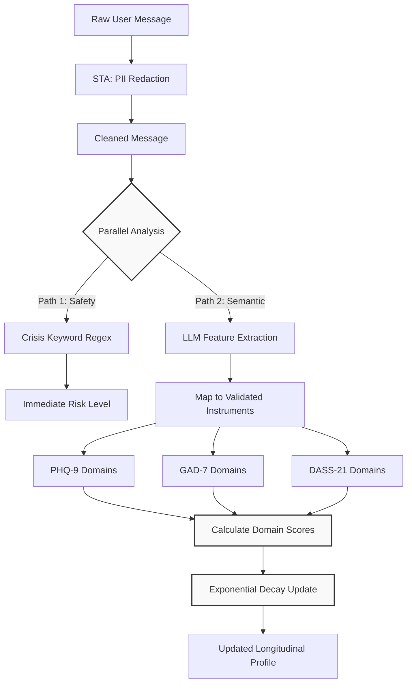
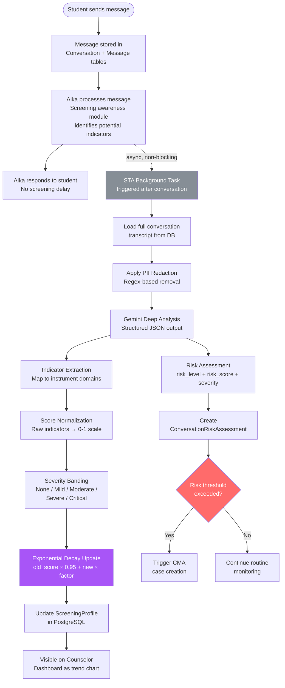
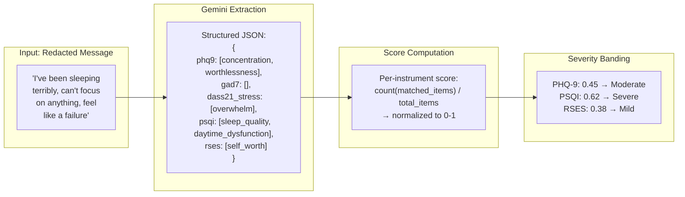
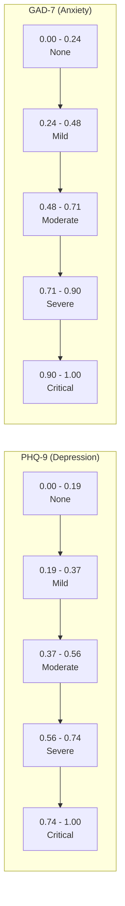
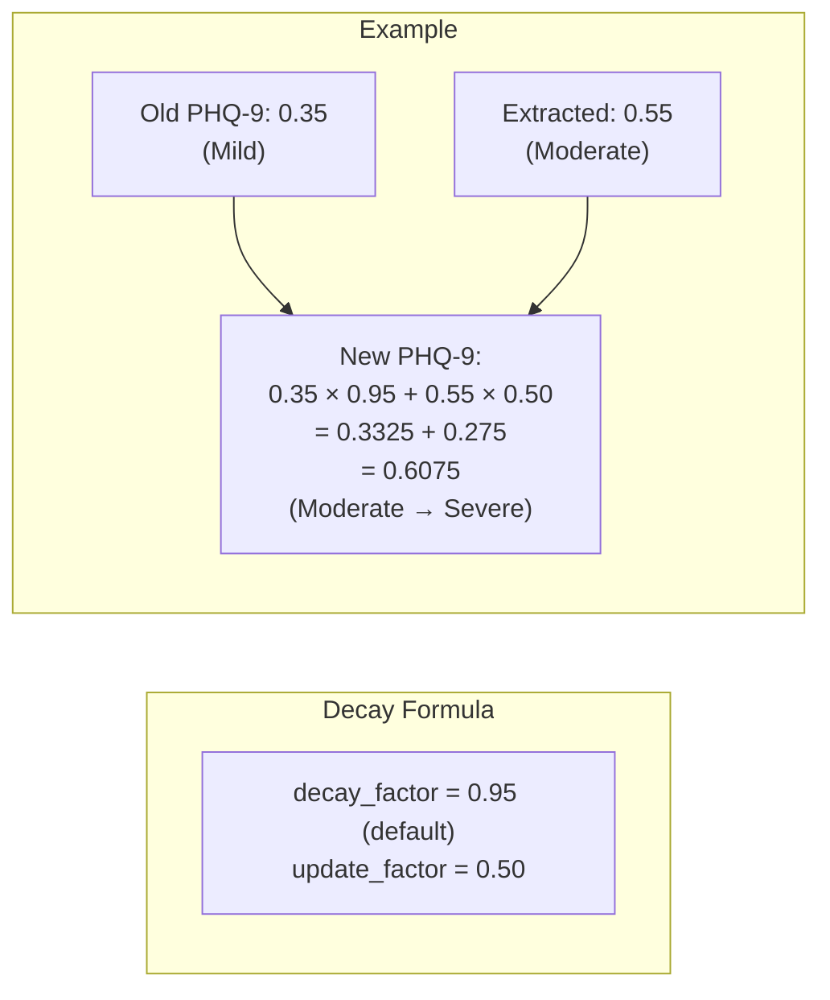
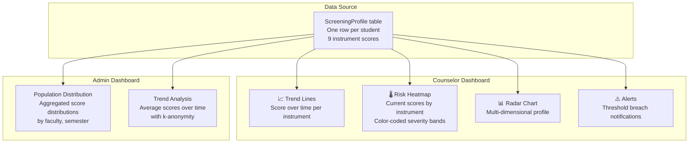

# Covert Screening System

UGM-AICare implements a continuous, covert mental health screening system that passively extracts psychological indicators from natural conversations. By evaluating users implicitly during normal interactions, the system mitigates social desirability bias and captures authentic emotional states.

---

## Methodology

The screening process is integrated directly into the Safety Triage Agent (STA) workflow. Every incoming user message undergoes a dual-analysis process: immediate risk assessment for safety, and longitudinal screening extraction.



---

## Screening Pipeline

The end-to-end pipeline covers everything from raw conversation messages through indicator extraction, score normalization, longitudinal profile updates, and dashboard visualization.



### Indicator Extraction Detail



---

## Validated Instruments

The system maps conversational features to domains established by scientifically validated clinical instruments:

| Instrument | Full Name | Domains | Items | Reference |
|------------|-----------|---------|-------|-----------|
| PHQ-9 | Patient Health Questionnaire-9 | Depression | 9 | Kroenke et al. (2001) |
| GAD-7 | Generalized Anxiety Disorder-7 | Anxiety | 7 | Spitzer et al. (2006) |
| DASS-21 | Depression Anxiety Stress Scales | Depression, Anxiety, Stress | 21 | Lovibond &amp; Lovibond (1995) |
| PSQI | Pittsburgh Sleep Quality Index | Sleep Quality | 19 (7 components) | Buysse et al. (1989) |
| UCLA-3 | UCLA Loneliness Scale v3 | Social Isolation | 20 | Russell (1996) |
| RSES | Rosenberg Self-Esteem Scale | Self-Esteem | 10 | Rosenberg (1965) |
| C-SSRS | Columbia Suicide Severity Rating | Suicidality | 6 | Posner et al. (2011) |
| AUDIT | Alcohol Use Disorders ID | Substance Use | 10 | Saunders et al. (1993) |
| SSI | Student Stress Inventory | Academic Stress | Adapted | Lakaev (2009) |

---

## Score Normalization &amp; Severity Bands

Each instrument uses specific thresholds normalized to a 0–1 scale:



| Instrument | None | Mild | Moderate | Severe | Critical |
|------------|------|------|----------|--------|----------|
| PHQ-9 | 0 – 0.19 | 0.19 – 0.37 | 0.37 – 0.56 | 0.56 – 0.74 | 0.74 – 1.0 |
| GAD-7 | 0 – 0.24 | 0.24 – 0.48 | 0.48 – 0.71 | 0.71 – 0.90 | 0.90 – 1.0 |
| DASS-21 Stress | 0 – 0.19 | 0.19 – 0.29 | 0.29 – 0.38 | 0.38 – 0.60 | 0.60 – 1.0 |
| PSQI | 0 – 0.20 | 0.20 – 0.40 | 0.40 – 0.60 | 0.60 – 0.80 | 0.80 – 1.0 |
| UCLA Loneliness | 0 – 0.20 | 0.20 – 0.40 | 0.40 – 0.60 | 0.60 – 0.80 | 0.80 – 1.0 |
| RSES | 0 – 0.20 | 0.20 – 0.40 | 0.40 – 0.60 | 0.60 – 0.80 | 0.80 – 1.0 |
| C-SSRS | 0 – 0.00 | N/A | N/A | 0.01 – 0.50 | 0.50 – 1.0 |

---

## Exponential Decay

The screening profile is updated with exponential decay to weight recent indicators more heavily:

```
new_score = old_score × decay_factor + extracted_weight × update_factor
```



| Property | Value | Rationale |
|----------|-------|-----------|
| `decay_factor` | 0.95 | 5% decay per conversation — gradual forgetting |
| `update_factor` | 0.50 | New evidence has significant but not overwhelming weight |
| Minimum update interval | Per conversation | Prevents rapid oscillation |
| Score bounds | [0.0, 1.0] | Clamped to valid range |

---

## Data Safety &amp; PII Redaction

Given the highly sensitive nature of mental health conversations, the system guarantees that conversational data cannot be linked back to an individual student by unauthorized personnel.

### Privacy Shield Architecture

Before any user message is logged or passed to secondary analysis components, it passes through the "Privacy Shield" — an intermediate redaction layer designed to sanitize text.

```mermaid
graph LR
 A[User Message: "I am feeling stressed. My name is Budi and my number is 0812345678"] --> B(STA: PII Redaction Engine)
 B --> C{Rules & NLP Models}
 C -->|Regex| D[Remove Numbers & Emails]
 C -->|NER| E[Remove Names & Locations]
 D --> F
 E --> F[Sanitized Message]
 F --> G[Database]
 F --> H[Insights Agent]
 
 classDef safe fill:#d4edda,stroke:#333,stroke-width:2px;
 class F,G,H safe;
```

### Anonymization vs. Pseudonymization

- **Pseudonymization (Database Layer):** For clinical continuity, the backend maps conversations to a user ID. The actual identity is stored separately and is only accessible by authorized counselors through the CMA during a Level 3 escalation.
- **Anonymization (Analytics Layer):** The Insights Agent operates strictly on anonymized data. Any query aggregating data is subject to **k-anonymity** where *k ≥ 5*. Queries returning fewer than 5 records are rejected to prevent statistical deanonymization.

---

## Dashboard Visualization


