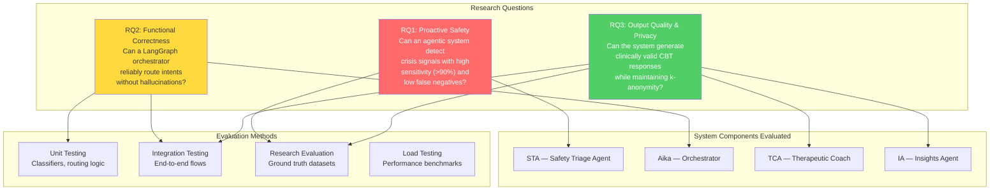
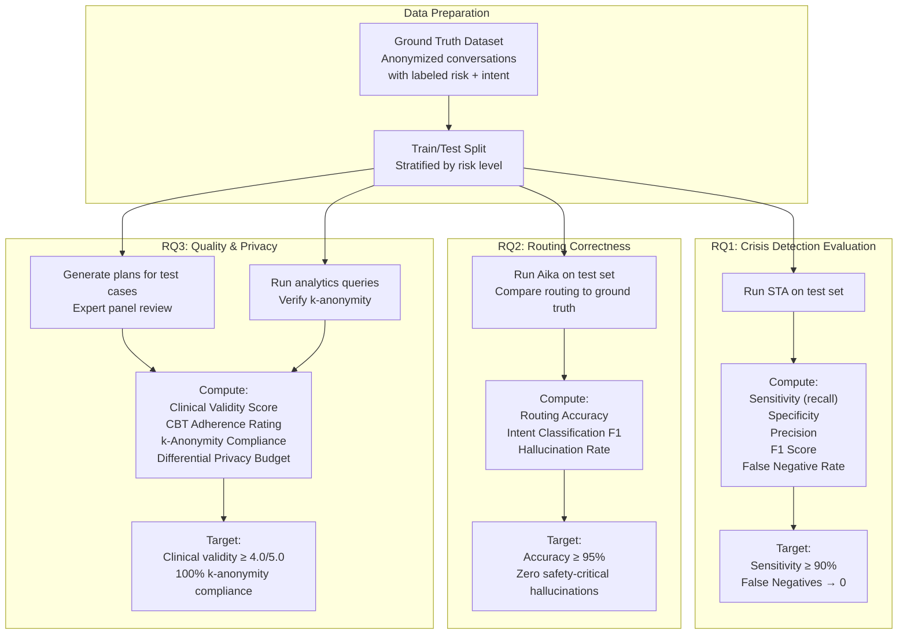
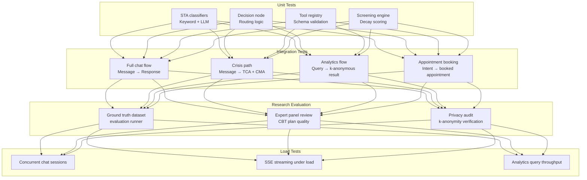

# Evaluation Framework &amp; Ethics

## Research Questions to System Mapping

---

## Evaluation Pipeline

---

## Evaluation Metrics

### RQ1 — Crisis Detection Metrics

| Metric | Formula | Target |
|--------|---------|--------|
| Sensitivity (Recall) | TP / (TP + FN) | ≥ 0.90 |
| Specificity | TN / (TN + FP) | ≥ 0.85 |
| Precision | TP / (TP + FP) | ≥ 0.80 |
| F1 Score | 2 × (P × R) / (P + R) | ≥ 0.85 |
| False Negative Rate | FN / (TP + FN) | ≤ 0.10 |
| Latency (Tier 1) | Keyword scan time | &lt; 5ms |
| Latency (Tier 2) | LLM classification time | &lt; 500ms |

### RQ2 — Routing Correctness Metrics

| Metric | Formula | Target |
|--------|---------|--------|
| Routing Accuracy | Correct routes / Total | ≥ 0.95 |
| Intent F1 | Per-class F1 macro-average | ≥ 0.90 |
| Safety-Critical Hallucinations | Incorrect HIGH→LOW routing | 0 |
| Small-Talk Precision | Correct skips / Total skips | ≥ 0.95 |
| Tool Call Accuracy | Correct tool invocations / Total | ≥ 0.90 |

### RQ3 — Quality &amp; Privacy Metrics

| Metric | Method | Target |
|--------|--------|--------|
| Clinical Validity | Expert panel rating (1-5) | ≥ 4.0 |
| CBT Adherence | Checklist compliance | ≥ 90% |
| Personalization | Novel strategies / Total | ≥ 80% |
| k-Anonymity Compliance | Cell count audit | 100% cells ≥ 5 |
| DP Budget | ε tracking per query | Within allocated ε |
| Privacy Attack Resistance | Re-identification attempts | 0 successful |

---

## Testing Strategy

Continuous testing is conducted throughout the CI/CD pipeline. Unit testing ensures validated instrument scoring algorithms (GAD-7, PHQ-9 thresholds) are mathematically exact. Integration testing validates state persistence and context retention between LangGraph nodes. Load testing confirms the backend handles concurrent background analysis and database writes without blocking the user-facing chat response.

---

## Clinical Governance &amp; Ethics

Deploying an autonomous agent in mental health requires stringent ethical frameworks and adherence to clinical safety boundaries. UGM-AICare is engineered under the principle that AI is a tool for augmentation and triage, **not a replacement for licensed human professionals** in crisis scenarios.

### Human-in-the-Loop Escalation

When the STA detects a Level 3 Risk (active crisis, severe self-harm, or suicidal ideation), the system enforces a strict, un-bypassable **Human-in-the-Loop (HITL)** protocol:

1. The Case Management Agent (CMA) instantly takes control of the conversation.
2. Autonomous therapeutic generation is suspended.
3. A clinical case is immediately generated and flagged for on-call human counselors via the administrator dashboard.
4. The system provides the user with emergency contact resources until a human counselor intervenes.

### Evidence-Based Interventions

All automated responses generated by the TCA for Level 1 and Level 2 risks are strictly constrained to established CBT principles and psychoeducation. The system explicitly refuses providing medical diagnoses or prescribing medication.

### Consent &amp; Auditability

- Users must explicitly consent to the covert screening mechanism during onboarding.
- The system maintains an immutable audit trail of user consents, data deletions, and high-risk case escalations.
- The AIKA Autopilot governance matrix ensures all high-impact operational decisions require explicit human authorization before execution.

---

## Privacy Safeguards

| Layer | Mechanism | Detail |
|-------|-----------|--------|
| **PII Redaction** | STA scrub pipeline | Removes names, phone numbers, addresses before storage or analytics |
| **k-Anonymity** | Insights Agent guard | Programmatically blocks any query returning &lt; 5 individuals |
| **Differential Privacy** | Laplace mechanism (pure ε-DP, event-level) | Calibrated noise on every IA aggregate release (ε per query, rolling budgeted window); RQ3 privacy compliance is checked against the real mechanism — see [Privacy & Analytics](../analytics/privacy-and-analytics.md#differential-privacy-implementation) |
| **Pseudonymization** | Database layer | Conversations mapped to user ID; actual identity only accessible via CMA during Level 3 escalation |
