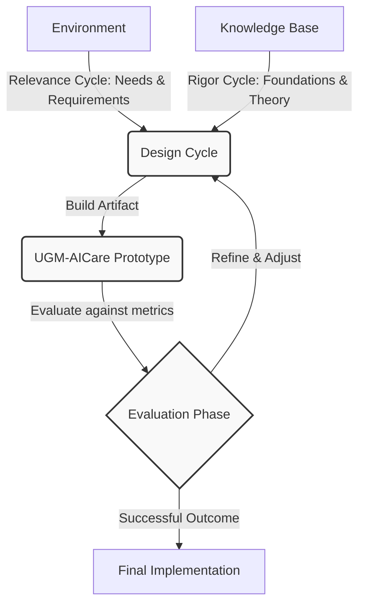

# Design Science Research (DSR) Methodology

The development of UGM-AICare follows the **Design Science Research (DSR)** methodology. This approach is highly suited for software engineering and information systems research, as it focuses on the creation and evaluation of innovative IT artifacts intended to solve complex, real-world problems.

## The Research Cycles

The DSR methodology is executed through an iterative cycle consisting of three primary phases:

### 1. The Relevance Cycle
The relevance cycle connects the context of the environment to the core DSR activities. For UGM-AICare, the environment is the university campus setting (specifically Universitas Gadjah Mada). The requirements are derived from the need for scalable, low-stigma, and proactive mental health support capable of serving thousands of students while maintaining clinical safety.

### 2. The Rigor Cycle
The rigor cycle connects the DSR activities with the existing knowledge base of scientific theories and engineering methods. UGM-AICare integrates several established frameworks:
- **Belief-Desire-Intention (BDI) Model:** For modeling rational multi-agent behavior.
- **Cognitive Behavioral Therapy (CBT):** For grounding the therapeutic responses in evidence-based clinical practices.
- **Validated Psychological Instruments:** Such as the PHQ-9, GAD-7, and DASS-21, used for covert risk assessment.

### 3. The Design Cycle
The design cycle is the iterative process of building and evaluating the artifact. This involves developing the LangGraph-based agentic orchestrator, testing the prompt configurations for accuracy and safety, and refining the human-in-the-loop escalation pathways based on simulated interactions and clinical review.

## System Architecture as an Artifact

The primary artifact of this research is the UGM-AICare Multi-Agent System. By framing the system as a DSR artifact, its performance is continuously evaluated not just on functional correctness, but on its utility in solving the specific problem of reactive capacity constraints in university counseling services.
