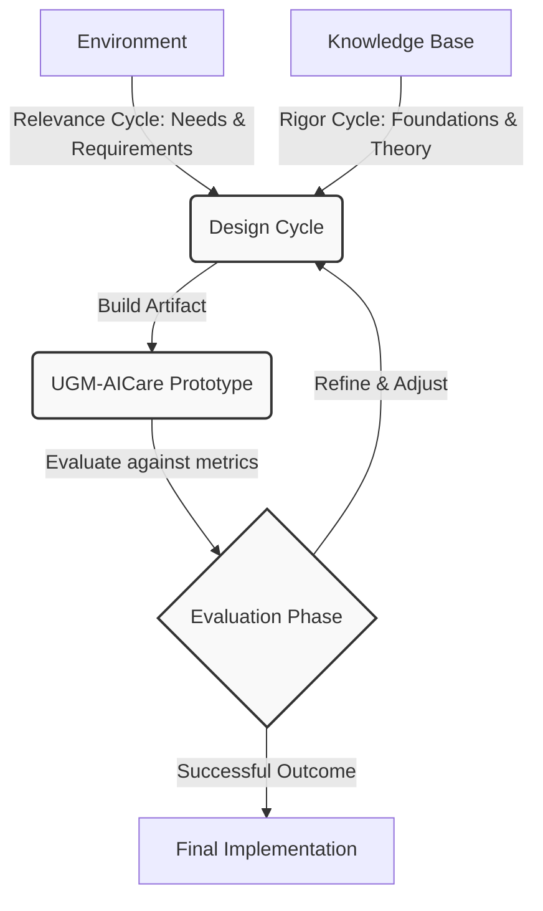

# Problem Statement &amp; Methodology

## The Reactive Crisis in University Mental Health

University mental health services globally face a "reactive capacity crisis." Traditional support systems are structurally limited, often failing to reach students who need help the most until their situations have escalated into crises.

### Structural Challenges

1. **The Reactive Nature of Care** — Students must independently recognize they have a problem, overcome stigma, navigate administrative barriers, and wait for an appointment. Throughout this process their condition may continue to deteriorate. The system waits for distress rather than preventing it.

2. **Capacity and Resource Gaps** — The counselor-to-student ratio at large universities frequently exceeds 1:1,000. Resources are primarily allocated to high-risk triage, leaving mild-to-moderate cases underserved.

3. **Blind Spots in Population Data** — University administrators lack real-time information on population-level mental health trends, preventing proactive resource prioritisation or identification of institutional pressure points.

4. **Cultural Friction and Stigma** — Particularly within the Indonesian university context, stigma surrounding mental health disclosures remains high. Students are significantly less likely to self-refer into formal psychiatric or counseling services.

### The Objective of UGM-AICare

UGM-AICare transitions the support paradigm from a reactive service to a proactive, agentic ecosystem. By leveraging a conversational AI interface, the system provides a low-friction, stigma-free environment for students to express their feelings. In the background, the platform continuously monitors for distress signals, autonomously provides evidence-based therapeutic interventions, and safely escalates critical cases to human professionals.

---

## Research Questions

| ID | Question | Focus |
|----|----------|-------|
| **RQ1** | Can an agentic system detect crisis signals with high sensitivity (&gt;90%) and low false negatives? | Proactive Safety |
| **RQ2** | Can a LangGraph-based orchestrator reliably route intents without hallucinations? | Functional Correctness |
| **RQ3** | Can the system generate clinically valid CBT responses while maintaining k-anonymity? | Output Quality &amp; Privacy |

---

## Design Science Research (DSR) Methodology

The development of UGM-AICare follows the **Design Science Research (DSR)** methodology, suited for software engineering and information systems research because it focuses on the creation and evaluation of innovative IT artifacts intended to solve complex, real-world problems.

### The Relevance Cycle

Connects the university campus environment (Universitas Gadjah Mada) to the core DSR activities. Requirements are derived from the need for scalable, low-stigma, and proactive mental health support capable of serving thousands of students while maintaining clinical safety.

### The Rigor Cycle

Connects DSR activities with the existing knowledge base:

- **Belief-Desire-Intention (BDI) Model** — for modeling rational multi-agent behavior.
- **Cognitive Behavioral Therapy (CBT)** — for grounding therapeutic responses in evidence-based clinical practices.
- **Validated Psychological Instruments** — PHQ-9, GAD-7, DASS-21 for covert risk assessment.

### The Design Cycle

The iterative process of building and evaluating the artifact: developing the LangGraph-based agentic orchestrator, testing prompt configurations for accuracy and safety, and refining the human-in-the-loop escalation pathways based on simulated interactions and clinical review.

### System Architecture as an Artifact

The primary artifact of this research is the UGM-AICare Multi-Agent System. By framing the system as a DSR artifact, its performance is continuously evaluated not just on functional correctness, but on its utility in solving the reactive capacity constraints in university counseling services.
